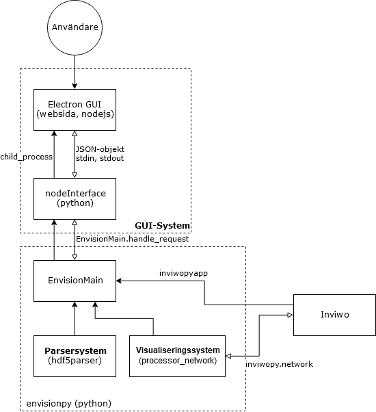
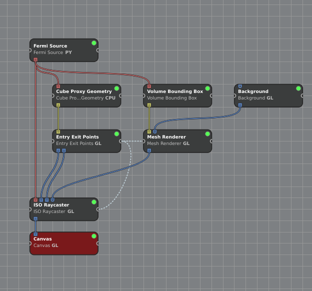
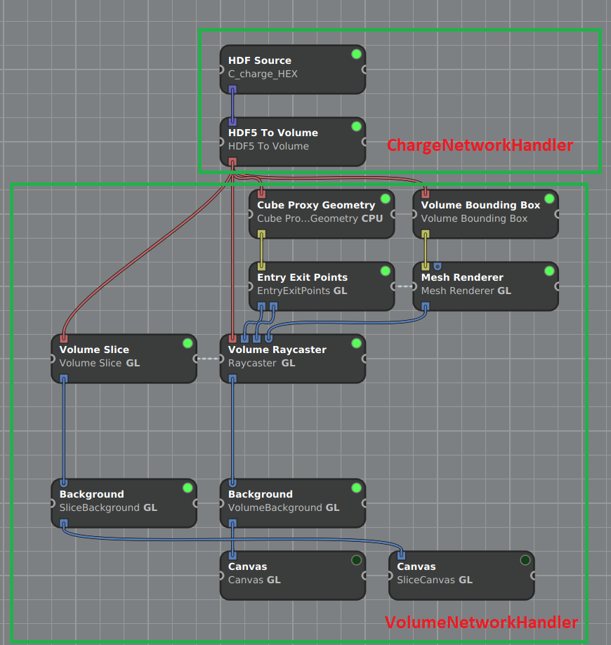

==============================
ENVISIoN teknisk dokumentation
==============================

.. sectnum::

| © 2017 - Josef Adamsson, Robert Cranston, David Hartman, Denise Härnström, Fredrik Segerhammar. *(Teknisk dokumentation - release 1)*
| © 2018 - Anders Rehult, Andreas Kempe, Marian Brännvall, Viktor Bernholtz. *(Teknisk dokumentation - release 2)*
| © 2019 - Linda Le, Abdullatif Ismail, Anton Hjert, Lloyd Kizito and Jesper Ericsson. *(Teknisk dokumentation - release 3)*
| © 2020 - Alexander Vevstad, Amanda Aasa, Amanda Svennblad, Daniel Thomas, Lina Larsson and Olav Berg. *(Teknisk dokumentation - release 4)*
| © 2017 – 2019 - Rickard Armiento, Johan Jönsson
| © 2020 - Rickard Armiento, Joel Davidsson

.. contents:: Innehåll
   :depth: 3

Bakgrund
========

Elektronstrukturberäkningar är ett viktigt verktyg inom teoretisk fysik
för att förstå hur materials och molekylers egenskaper kan härledas från
kvantmekaniska effekter. För att förstå dessa egenskaper är det viktigt
att kunna analysera data från beräkningarna, något som förenklas och
görs möjligt genom visualisering. ENVISIoN är en kraftfull mjukvara som
är avsedd för visualisering av data från beräkningsprogram som VASP.
Mjukvaran bygger på forskningsverktyget Inviwo, utvecklad av
Visualiseringscenter i Norrköping. Idén med ENVISIoN är att underlätta
visualiseringarna från kvantmekaniska beräkningar. Det ska vara enkelt
och smidigt att visualisera önskade och relevanta egenskaper hos olika
system bestående av atomer. Mjukvaran tillgängliggör olika reglage och
knappar för att på ett interaktivt sätt kunna ändra dess egenskaper. I
följande dokument kommer de tekniska aspekterna av hur systemet är
implementerat att redovisas.

Definitioner
------------

-  **Inviwo:** Ett forskningsverktyg som utvecklas vid Linköpings
   universitet och ger användaren möjlighet att styra visualisering med
   hjälp av programmering i Python3 eller grafiskt. Det tillhandahåller
   även användargränssnitt för interaktiv visualisering [Inviwo]_.

-  **Processor:** Benämningen på ett funktionsblock i Inviwos
   nätverksredigerare som tar emot indata och producerar utdata. I detta
   dokument avser en processor alltid en inviwoprocessor om inte annat
   anges.

-  **Canvas:** En processor i Inviwo som ritar upp en bild i ett
   fönster.

-  **Data frame:** En tabell med lagrad data i form av tal. Varje kolumn
   i tabellen har ett specifikt namn.

-  **Transferfunktion:** Begrepp inom volymrendering för den funktion
   som används för att översätta volymdensiteter till en färg.

-  **Transferfunktionspunkt:** Ett värde i transferfunktionen som
   definerar en färg vid ett speciellt densitetsvärde.

-  **Port:** Kanal som processorer använder för att utbyta data av
   specifika typer.

-  **Property:** En inställning i en Inviwoprocessor.

-  **Länkar:** Kanaler som processorer använder för att länka samman
   properties av samma typ så att deras tillstånd synkroniseras.

-  **Nätverk:** Ett antal processorer sammankopplade via portar och
   länkar.

-  **Volymdata:** Tredimensionell data som beskriver en volym.

-  **API:** Application Programming Interface, en specifikation av hur
   olika applikationer kan användas och kommunicera med en specifik
   programvara. Detta utgörs oftast av ett dynamiskt länkat
   bibliotek [API]_.

-  **BSD2:** En licens för öppen källkod [BSD2]_.

-  **C++:** Ett programmeringsspråk [Cpp]_. I Inviwo
   används C++ för att skriva programkod till processorer.

-  **Python3:** Ett programmeringsspråk [Python]_ [Python3]_. I
   Inviwo används Python3 för att knyta samman processorer.

-  **Fermienergi:** Energinivån där antalet tillstånd som har en energi
   lägre än Fermienergin är lika med antalet elektroner i systemet [Fermi-energi]_.

-  **Git**: Ett decentraliserat versionshanteringssystem [Git]_.

-  **GUI:** (Graphical User Interface) Ett grafiskt användargränssnitt [GUI]_.

-  **PyQT:** En python-modul för
   GUI-programmering [PyQT]_.

-  **wxPython:** En samling av python-moduler för
   GUI-programmering [wxPython]_.

-  **PKF** En förkortning på Parkorrelationsfunktionen. Vilket ibland
   slarvigt kan anges synonymt som RDF, Radial Distribution Function [RadialDistributionFunction]_.

-  **HDF5:** Ett filformat som kan hantera stora mängder data. Alla
   HDF5-objekt har en rotgrupp som äger alla andra objekt i
   datastrukturen. Denna grupp innehåller i sin tur all övrig data i
   form av andra grupper, länkar till andra grupper eller dataset.
   Dataset innehåller rådata av något slag. Rådata kan i sammanhanget
   vara bilder, utdata från beräkningar, programdata, etc. [HDFGroup]_ [HDFGroup2]_.

   De övriga objektstyperna gås inte igenom i detalj i detta dokument,
   men finns väl beskrivna i *High Level Introduction to HDF5* [HDFGroup2]_.

-  **VASP:** The Vienna Ab initio simulation package, ett program för
   modellering på atomnivå, för t.ex. elektronstruktusrberäkningar och
   kvantmekanisk molekyldynamik [VASP]_.

-  **Parser:** Ett system som översätter en viss typ av filer till en
   annan typ av filer. I detta fall sker översättningen från textfiler,
   genererat i beräkningsprogrammet VASP, till HDF5-filer.

-  **Parsning:** Översättning utförd av parsern.

-  **Mesh** - Beskriver ett geometriskt objekt som en uppsättning av
   ändliga element.

-  **Array** - Ett dataobjekt som fungerar som behållare för element av
   samma typ  [WhatIsArray]_.

-  **UNIX** - Benämning av en grupp operativsystem som härstammar från
   UNIX System from Bell Labs  [WhatIsUNIX]_.

Översikt av systemet
====================

.. figure:: figures/system_overview.png
   :name: fig:oversikt
   :align: center
   :width: 100 %
   :figwidth: 80 %
   :alt: oversikt

   Enkel skiss över systemet

Den produkt som utvecklas är ett verktyg för att visualisera viktiga
egenskaper från elektronstrukturberäkningar. Systemet skall bestå av ett
användargränssnitt där användaren får välja vilka beräkningsresultat som
skall konverteras och visualiseras.

I figur fig:oversikt_ visas en grov systemskiss med
de olika delsystem som ingår. Systemet kan grovt delas upp i tre olika
delar. Ett system för databearbetning som parsar filer från VASP, ett
system för att visualisera det som parsas i tidigare nämnt system, och
ett GUI-system vilket användaren interagerar med visualiseringen via.

Ingående delsystem
------------------

Systemet för elektronvisualisering består i huvudsak av tre delar. Dels
består systemet av en databearbetningsdel där parsning av textfiler genererade från
beräkningsprogrammet VASP skall översättas till det, med vår mjukvara,
kompatibla filformatet HDF5.

När denna filkonvertering är klar så ska de genererade filerna behandlas
i ett visualiseringssystem för att skapa önskade visualiseringar.
Visualiseringen i Inviwo byggs upp av processorer vilka datan låts flöda
igenom för att skapa önskat slutresultat.

Den sista delen av systemet är det som möter användaren, det grafiska
användargränssnittet, GUI:t. Genom detta system skall tillgång till att
starta och göra ändringar i visualiseringen ges. Målet är att kunna
styra hela systemet från GUI:t som en fristående del från de två första
delsystemen.

Ingående delsystem, mer avancerat
---------------------------------
Detta kapitel beskriver översiktligt delsystemens relationer och kommunikation med varandra.
Det är menat som en sammanfattning av det som kan läsas mer utförligt i kapitlen om de specifika systemen.
För att läsa detta rekomenderas en allafall grundläggande kunskap om hur inviwo de olika delsystemen fungerar.

   Skiss över delsystemens relationer till varandra.

Parsersystemet och visualiseringssystemet ingår i en pythonmodul kallad *envisionpy*. Se [Envisionpy]_ för mer detaljerad beskrivning.
Denna modul kan importeras från pythonskript för att få tillgång till ENVISIoNs funktionalitet.
Envisonpy har också en klass *EnvisionMain* (se [EnvisionMain]_ för mer ingående). EnvisionMain har som uppgift att vara ett gränssnitt där
envisionpy kan styras från ett utomliggande pythonskript. EnvisionMain initierar en instans av Inviwo, genom
pythonmodulerna inviwopyapp och inviwopy, som den kör i bakggrunden.
Detta gör att Inviwos funktioner kan användas utan att Inviwos gränssnitt visas.

EnvisionMain-klassen har funktioner för att starta parsning genom att köra funktioner från *envisionpy.hdf5parser*
(parsning beskrivet i [Parsersystemet]_), och starta visualiseringar
genom att initiera och styra *NetworkHandler*-klasser (se [Visualiseringssystemet]_, [NetworkHandlers]_).

Grässnittet är inte en del av envisionpy, utan är ett eget relativt isolerat system. Gränssnittet bygger
på electron och nodejs och är skrivet med HTML, CSS, och JavaScript. Se [GUI-systemet]_ för mer detaljerad information.

När systemet startas så laddas först den websida som är gränssnittet som användaren ser.
Från JavaScript-koden startas sedan, med hjälp av node-modulen child_process, en pythonprocess som kör skriptet *nodeInterface.py*. Detta skript
initerar ett *EnvisionMain*-objekt. Det tar också hand om kommunikation mellan javascript och python-processerna.
Javascript- och pythonprocesserna kommunicerar med varandra genom att läsa och skriva
JSON-object i pythonprocessens *stdin* och *stdout*.

Gränssnittet kan alltså nu begära att *EnvisionMain* ska utföra olika funktioner genom att skicka JSON-paket
till den pythonprocess som startats.

Parsersystemet
==============

Parserystemets uppgift är att omvandla information från VASP-filer till
data i HDF5-format, som visualiseringssystemet kan använda.
Parsersystemet är det delsystem i ENVISIoN som ser till att avläsa
korrekt data från VASP-filer och spara denna data i en lämplig
HDF5-filstruktur. Följande kapitel beskriver hur parsersystmet har
implementerats, samt redogör bakgrundskunskaper om HDF5 och VASP.

Parsersystemet är implementerat i pythonkod och ligger under envisionpy-modulen
i envitionpy.hdf5parser.

Bakgrundskunskap
----------------

För förståelse över hur parsersystemet implementerats krävs det lite
bakgrundskunskaper om hur HDF5 är uppbyggt och vad VASP är.

VASP
~~~~

VASP är ett beräkningsprogam som använder sig av Hartree-Fock metoden
eller täthetsfunktionalteori (DFT) för att approximera en lösning för
Schrödingerekvationen för mångpartikelfallet [QuickStartGuide]_. VASP-filer kan delas upp i
indatafiler och utdatafiler. I indatafiler anges information som
användaren kan manipulera, dessa indatafiler styr hur beräkningarna ska
utföras. Efter beräkningar genereras sedan ett antal utdatafiler som
innehåller kalkylresultaterna. Varje datafil korresponderar till
specifik information om systemet. Nedan återfinns några viktiga
VASP-filer.

**Utdatafiler:**

-  CHG innehåller data om laddningstäthet.

-  DOSCAR innehåller data om tillståndstäthet.

-  EIGENVAL innehåller data för alla energier för k-rummet.

-  OUTCAR innehåller alla utdata.

-  XDATCAR innehåller data om enhetscell, atompositioner för varje
   beräkningssteg och även atomstyp.

-  CONTCAR innehåller data som den återfunnen i POSCAR, men innehåller
   information om atompositioner uppdateras.

-  PCDAT Innehåller data för parkorrelationsfunktionen, PKF.

**Indatafiler:**

-  KPOINTS innehåller information om k-parametrarnas koordinater och vikter,
   alternativt instruktioner om hur en k-punkts mesh genereras av VASP.

-  INCAR innehåller information, i form av flaggor över hur beräkningar
   ska ske.

-  POSCAR innehåller data om enhetcellen och atompositionering.

-  POTCAR innehåller data om atomtyper.

Vid exempelvis beräkning av PKF för Si i temperaturen 300K, specificeras
information om hur systemet ser ut i filer som POSCAR. Sedan kan
information om hur beräkningarna ska genomföras specificeras i
exempelvis INCAR eller POTCAR. Detta kan röra sig om hur många
iterationer som ska ske och i vilka avstånd PKF ska beräknas. Då kan
exempelvis flaggor som NPACO och APACO sättas i INCAR-filen. Där flaggan
NPACO specificerar hur många iterationer som sker och APACO bestämmer
det längsta avståndet som sista iteration ska ha.

Efter beräkningen genereras flera utdatafiler, däribland PCDAT, som
innehåller värdena av PKF. Utdatafilen, PCDAT, kan då ha följande
utseende:

.. figure:: figures/PCDAT_utseende.png
   :name: fig:PCDAT_utseende
   :align: center
   :width: 100%
   :figwidth: 50%
   :alt: PCDAT_utseende

   En demonstrativ bild över utseendet för PCDAT från VASP. Notera att värdena inte riktigt stämmer.

Bilden ovan beskriver
utseendet hos en del av PCDAT-filen för PKF för systemet Si i 300K, med
40 olika tidsteg. Viktigaste är den långa kolumnen av siffror som utgör
definitionsmängden till funktionen.

.. _sec:rotgruppstr:

HDF5-format
~~~~~~~~~~~

Vid hantering av stora mängder data, sådana genererade av
beräkningsprogram som VASP, är HDF5-formatet mycket användbart. Det gör
specificiering av olika dataförhållanden och beroenden enkla, samt
tillgängliggör bearbetning av delar av data åt gången.

En HDF5-fil är ett objekt som innehåller en rotgrupp, som äger alla
andra grupper under den. Denna rotgrupp kan symboliseras av
`/`. Exempelvis `/foo/zoo` symboliserar *zoo* som är en medlem
till *group* *foo*, som vidare är en medlem till rotgruppen.
Ett *dataset* kan pekas av flera *groups* [HDFGroup2]_.

.. figure:: figures/DemonstrativHDF5bild.png
   :name: fig:DemonstrativHDF5bild
   :align: center
   :width: 100 %
   :figwidth: 50 %
   :alt: DemonstrativHDF5bild

   Schematisk bild över HDF5 struktur

Mer ingående består *dataset*-objektet av metadata och rådata. Metadata
beskriver rådatan, till den ingår *dataspace*, *datatype*, *properties*
och *attributes*. Alla dessa är HDF5-objekt som beskriver olika saker.

*datatype* beskriver vad för datatyp varje individuell dataelement i ett
dataset har. Exempelvis kan detta vara ett 32-bitars heltal, eller ett
32-bitars flyttal. I det mer komplexa fallet kan det också vara en
sammansättning av flera, vanligt benämnda, datatyper. *Datatype*
beskriver då en följd av olika datatyper. Exempelvis en sammansättning
som int16, char, int32, 2x3x2 array av 32-bit floats beskriver att varje
dataelement i det gällande datasetet har en datatyp som består av 16
bitars heltal, en bokstav, 32-bitars heltal och slutligen en array av
flyttal med dimensionen 2x3x2. *dataspace* är en HDF5-objekt som
beskriver hur datasetet sparar sin data, den kan exempelvis vara tom.
Ett dataset kan även bestå av ett enda tal, eller vara en array.
*Properties* är mindre konkret än de två tidigare nämnda egenskaperna
och beskriver minneshanteringen av ett dataset. I dess defaultläge
exempelvist är dataset sparade kontinuerligt. Slutligen återfinns
HDF5-objektet *attributes*, som kan valbart skapas. Typiskt sätt skapas
*attributes* som ett sätt för att ytterligare beskriva några egenskaper
hos ett dataset. En *attribute* innehåller ett namn och ett värde, och
skapas i samband med att ett dataset öppnas [HDFgroup2]_.

.. figure:: figures/Dataset_Metadata_HDF5.png
   :name: fig:Dataset_Metadata_HDF5
   :align: center
   :width: 50 %
   :figwidth: 50 %
   :alt: Dataset_Metadata_HDF5

   Schematisk bild över *dataset*.

ENVISIoN arbetar med HDF5-formatet. Python ger tillgång till hantering
av HDF5-formatet via paketet *h5py*. Detta tillgängliggör exempelvis
läsandet av specifika element i massiva arrayer med användandet av
syntaxer tillgängliga av paketet *numpy* [HowToUseHDF5FilesinPython]_.

Paketet *h5py* ger upphov till HDF5-filer vilket kan ses som behållare
för två sorters objekt, *datasets* och *groups*. *datasets* är
array-liknande ihopsättning av data, medan *groups* fungerar som
behållare för andra *groups* eller *datasets* [HowToUseHDF5FilesinPython]_. Elementen i
*datasets* kan vara komplexa objekt. *groups* kan återfinnas i andra
*groups*, detta ger därmed möjlighet till konstruktion av grupperingar
av olika sammanhängande data. *groups* och medlemmarna till *groups*
fungerar som mappar och filer i UNIX. Varje *dataset* karaktäriseras
exempelvis av en sökväg [HDFGroup2]_.

ENVISIoNs HDF5-fil
------------------

ENVISIoNs parsersystem använder sig av pythonmodulen *h5py* för att
generera en lämplig HDF5-filstruktur vid parsning. Den HDF5-strukturen
som genereras återfinns i nedstående diagram. Notera att figuren visas
som helbild i Appendix sec:appendixHDF5_.

.. figure:: figures/UPDATE-hdf5-dataformat3modi.png
   :name: fig:ENVISIoNsHDF5
   :align: center
   :width: 100%
   :figwidth: 100%
   :alt: ENVISIoNsHDF5

   En bild över HDF5-filstruktur som används i ENVISIoN.

I diagram fig:ENVISIoNsHDF5_ nedan
representeras olika grupper (*groups*) av lådor med pilar (förutom
lådorna vars brödtext är angiven i parantes), de sista lådorna i slutet
av varje förgrening representerar olika *dataset*. Diagrammet beskriver
alltså hur information struktureras i en HDF5-fil som parsersystemet
skapat. För att få tillgång till ett visst *dataset* måste en sökväg
anges. Denna sökväg är inget mer än en sträng bestående av olika grupper
som beskriver hur ett *dataset* nås från rotgruppen, se under rubrik
sec:rotgruppstr_.

Varje *dataset* kan bestå av ett antal olika fältnamn. Det fältnamn som
alltid förekommer är *value*, vilket beskriver den huvudsakliga datan
som datasetet innehåller. Utöver det kan vissa andra fältnamn också
förekomma, exempelvis "VariableName" vilket är olika attribut,
*attributes*, som beskriver andra egenskaper hos *dataset* som kan vara
intressant.

Notera att diagram fig:ENVISIoNsHDF5_ saknar
viss information för DOS. DOS står för Density of States, översatt till
tillståndstäthet. På grund av platsbrist har inte attributen skrivits ut
för DOS. p-DOS, d-DOS(xy), Energy, grupper under DOS, med mera har
attributen

-  VariableName är fältets namn.

-  VariableSymbol är en symbol som representerar variabeln.

-  QuantityName är ett för en människa läsligt namn på fältet.

-  QuantitySymbol är symbol som representerar storheten.

-  Unit är storhetens fysikaliska enhet.

Notera också att *float[x]* avser en lista med längd x, samt att alla
grupper som är märkta med n är en metod att ange att det kan finnas flera
grupper på den nivån. Lådor vars rubrik är angivet inom parentes anger
ett villkor för att den resterande sökvägen ska kunna skapas. Viktig
anmärkning här är därför att dessa villkor inte ingår i HDF5-strukturen,
de är inga grupper, och ingår därmed inte med sökvägen till de
respektive dataseten. Under *DOS* förekommer exempelvis en sådan låda
med brödtexten *(LORBIT=0)*, samt under förgreningen hos *DOSPartial*
förekommer en låda med angivelsen *(ISPIN=0)*. Båda *ISPIN* och *LORBIT*
är flaggor som kan sättas i INCAR-filen. I detta fall anger lådorna
villkoren att *(LORBIT=0)* och *(ISPIN=0)* för att den fortsatta
respektive grupperna under ska kunna skapas. Lådan under
*PairCorrelationFunc* anger dock ingen sådan flagga. Det den anger är
villkoret som har med huruvida *\_write\_pcdat\_onecol* eller
*\_write\_pcdat\_multicol* används.

Parsning av PKF ges av olika möjligheter, parsern behandar en av
följande fall:

#. System av flera atomtyper, det som beräknas är en genomsnittlig PKF
   över alla atomtyper.

#. System av flera atomtyper, det som beräknas är en genomsnittlig PKF
   för varje atomtyp. Ingår det K atomtyper i systemet ska parsern ge
   upphov till K stycken parkorrelationsfunktioner.

#. System av 1 atomtyp.

För fall 2 och 3 används *\_write\_pcdat\_multicol* medan fall 1 använder
*\_write\_pcdat\_onecol*, se under rubrik
sec:skrivningtillHDF5_. Villkoren är därmed enbart ett sätt
att ange vad för fall parsern behandlar.

.. _sec:skrivningtillHDF5:

Skrivning till HDF5-fil
-----------------------

Det som skapar strukturen i HDF5-filen är skrivningsmodulen *h5writer* I
ENVISIoN. *h5writer.py* är ett skript som innehåller alla
skrivningsfunktioner som ingår i parsersystemet. Funktionernas uppgift
är att skapa *datasets* (rådata) i rätt plats i HDF5-fil objektet. Nedan
listas alla funktioner som ingår i modulen.

**\_write\_coordinates** Denna funktion skriver koordinater för
atompositioner där varje atomslag tilldelas ett eget *dataset*. Attribut
sätts för respektive grundämnesbeteckning per *dataset*.

Parametrar:

-  h5file: Sökväg till HDF5-fil, anges som en sträng.

-  atom\_count: Lista med antalet atomer av de olika atomslagen.

-  coordinates\_list: Lista med koordinater för samtliga atomer.

-  Elements: None eller lista med atomslag.

Returnerar:

-  None

**\_write\_basis** Denna funktion skriver gittervektorerna i ett dataset
med namn basis.

Parametrar:

-  h5file: Sökväg till HDF5-fil, anges som en sträng.

-  basis: Lista med basvektorerna.

Returnerar:

-  None

**\_write\_scaling\_factor** Denna funktion skriver skalfaktorn för gittret i ett dataset
med namn scaling\_factor.

Parametrar:

-  h5file: Sökväg till HDF5-fil, anges som en sträng.

-  scaling\_factor: Skalfaktorn för gittret.

Returnerar:

-  None

**\_write\_fermi\_energy** Denna funktion skriver fermi-energin i ett dataset
med namn FermiEnergy.

Parametrar:

-  h5file: Sökväg till HDF5-fil, anges som en sträng.

-  fermi\_energy: Fermi-energin för den aktuella uträkningen.

Returnerar:

-  None

**\_write\_bandstruct** Denna funktion skriver ut data för bandstruktur i
en grupp med namn Bandstructure. Inom denna grupp tilldelas specifika
K-punkter, energier samt bandstrukturer egna dataset. Högsymmetripunkter och deras
symboler tilldelas egna dataset. Diverse attribut sätts även för bl.a. specifika energier.

Parametrar:

-  h5file: Sökväg till HDF5-fil, anges som en sträng.

-  band\_data: Lista med bandstrukturdata.

-  kval\_list: Lista med K-punkter för specifika bandstrukturdata.

Returnerar:

-  None

**\_write\_dos** Denna funktion skriver ut DOS-data i en grupp med namn
DOS där total och partiell DOS tilldelas grupper med namn Total
respektive Partial. Inom gruppen Total tilldelas energin samt specifika
DOS egna dataset och inom gruppen Partial tilldelas varje partiell DOS
egna grupper där energin samt specifika DOS tilldelas egna dataset.

Parametrar:

-  h5file: Sökväg till HDF5-fil, anges som en sträng.

-  total: En lista med strängar av de olika uträkningarna som har
   utförts av VASP för total DOS.

-  partial: En lista med strängar av de olika uträkningarna som har
   utförts av VASP för partiell DOS.

-  total\_data: En lista med alla beräkningar för total DOS för varje
   specifik atom.

-  partial\_list: En lista med alla beräkningar för partiell DOS för
   varje specifik atom.

-  fermi\_energy: Fermi-energin för den aktuella uträkningen.

Returnerar:

-  None

**\_write\_volume** Denna funktion skriver ut elektrontäthetsdata och
elektronlokaliseringsfunktionsdata (ELF) till grupper med namn CHG
respektive ELF. Inom dessa grupper tilldelas varje iteration ett
dataset.

Parametrar:

-  h5file: Sökväg till HDF5-fil, anges som en sträng.

-  i: Skalär som anger numret på iterationen.

-  partial: En lista med strängar av de olika uträkningarna som har
   utförts av VASP för partiell DOS.

-  array: Array med parsad data för respektive iteration.

-  data\_dim: Lista som anger dimensionen av data för respektive
   iteration.

-  hdfgroup: En textsträng med namnet på vad man vill kalla gruppen i
   HDF5-filen.

Returnerar:

-  None

**\_write\_incar** Denna funktion skriver ut parsad data från INCAR i ett
dataset med namn Incar där varje datatyp tilldelas egna dataset.

Parametrar:

-  h5file: Sökväg till HDF5-fil, anges som en sträng.

-  incar\_data: Datalexikon med all data från INCAR-filen.

Returnerar:

-  None

**\_write\_pcdat\_onecol** Denna funktion skapar ett HDF5-struktur för ett
system med flera atomtyper, där en genomsnittlig PKF beräknas för alla
atomtyper. Funktionen skapar en HDF5-struktur som innehåller data från
huvudsakligen PCDAT.

Parametrar:

-  h5file: Sökväg till HDF5-fil, anges som en sträng.

-  pcdat\_data: Tillhör Python-datatypen *dictionary* [dict]_. Detta argument innehåller alla värden av
   PKF som parsats.

-  APACO\_val: Värdet på APACO-flaggan i VASP-filen INCAR eller POTCAR.
   Defaultvärde är 16 Ångström. Flaggan anger det längsta avståndet
   sista iteration för beräkning av PKF har.

-  NPACO\_val: Värdet på NPACO-flaggan i VASP-filen INCAR eller POTCAR.
   Defaultvärde är 256. Flaggan anger hur många iterationer ska ske för
   beräkning av PKF.

Returnerar:

-  None

**\_write\_pcdat\_multicol** Denna funktion skapar ett HDF5-struktur för
ett system med flera atomtyper, där en genomsnittlig PKF beräknas för
varje atomtyp som ingår i systemet. Funktionen anropas också i fallet då
systemet enbart består av en atomtyp. Funktionen skapar en HDF5-struktur
som innehåller data från huvudsakligen PCDAT.

Parameterar:

-  h5file: Sökväg till HDF5-fil, anges som en sträng.

-  pcdat\_data: Tillhör Python-datatypen *dictionary* [dict]_. Detta argument innehåller alla värden av PKF som parsats.

-  APACO\_val: Värdet på APACO-flaggan i VASP-filen INCAR eller POTCAR.
   Defaultvärde är 16 Ångström. Flaggan anger det längsta avståndet
   sista iteration för beräkning av PKF har.

-  NPACO\_val: Värdet på NPACO-flaggan i VASP-filen INCAR eller POTCAR.
   Defaultvärde är 256. Flaggan anger hur många iterationer ska ske för
   beräkning av PKF.

Returnerar:

-  None

.. _sec:inläsning av VASP:

Inläsning av VASP-filer
-----------------------

Innan en funktion kan skriva till HDF5-objektet krävs det att rätt
inläsning av innehåll från relevant VASP-fil har skett. Detta är vad de
olika läsningsfunktionerna i parsersystemet gör. Typiskt återfinns en
pythonmodul för varje egenskap hos ett system som ska parsas. Nedan
listas alla sådana moduler.

Bandstrukturparser
~~~~~~~~~~~~~~~~~~

Bandstrukturparsern läser in alla energier för k-parametrar från EIGENVAL-filen
i användarens VASP-mapp, som skrivs till /Bandstructure i HDF5-filen och
dessutom skrivs de inlästa k-parametrarnas koordinater från EIGENVAL-filen
in i /BandStructure i HDF5-filen. Högsymmetripunkteroch dess symboler
läses av från KPOINTS-filen och Bravais-gittrets typ läses av
från OUTCAR-filen i användarens VASP-mapp och dessa punkter och tillhörande
symboler skrivs in i egna datasets under /Highcoordinates i HDF5-filen.

Funktionsanrop: envisionpy.hdf5parser.bandstructure(h5file, vasp\_dir)

Parameterar:

-  h5file: Sökväg till HDF5-fil, anges som en sträng.

-  vasp\_dir: Sökväg till VASP-katalog, anges som en sträng.

Returnerar:

-  Bool: True om parsning skett felfritt, False annars.

Incarparser
~~~~~~~~~~~

Incarparsern består av en pythonfil med namnet incar som innehåller
funktionerna, incar och parse\_incar. Dessa funktioner läser in och
sparar information från INCAR-filen samt anropar en separat pythonmodul
som skriver en HDF5-fil.

Funktionen incar kontrollerar att HDF5-filen redan innehåller INCAR-data
och anropar funktionen parse\_incar om så inte är fallet. Existerar
INCAR-filen i användarens VASP-katalog parsas data av funktionen
parse\_incar som då sparar ett dataset för varje datatyp och namnger
dataseten därefter. Funktionen incar anropar sedan pythonmodulen som
skriver HDF5-filen där varje enskilt *dataset* tilldelas en egen grupp.

Funktionsanrop: envisionpy.hdf5parser.incar(h5file, vasp\_dir)

Parameterar:

-  h5file: Sökväg till HDF5-fil, anges som en sträng.

-  vasp\_dir: Sökväg till VASP-katalog, anges som en sträng.

Returnerar:

-  Lista med namn på data (*datasets*) som parsas.

-  Bool: True om parsning skett felfritt, False annars.

Volymparser
~~~~~~~~~~~

Volymparsern består av en mängd funktioner i en pythonfil som används
för parsning av CHG och ELFCAR. Den kan läsa in och spara data på
HDF5-format från båda dessa filer genom att anropa en pythonmodul. Detta
är för att CHG och ELFCAR har samma struktur och består av ett antal
iterationer av volymdata från volymberäkningar. Således innehåller den
sista iterationen data som är mest korrekt. Därför skapar volymparsern
också en länk till den sista iterationen i HDF5-filen för att data av
högst kvalitet lätt ska kunna plockas ut.

Funktionsanrop vid parsning av CHG-data:
envisionpy.hdf5parser.charge(h5file, vasp\_dir)

Funktionsanrop vid parsning av ELFCAR-data:
envisionpy.hdf5parser.elf(h5file, vasp\_dir)

Parameterar:

-  h5file: Sökväg till HDF5-fil, anges som en sträng.

-  vasp\_dir: Sökväg till VASP-katalog.

Returnerar:

-  Bool: True om parsning skett felfritt, False annars.

Tillståndstäthetsparser
~~~~~~~~~~~~~~~~~~~~~~~

Tillståndstäthetsparsern består av en mängd funktioner i en pythonfil
som används för parsning av DOSCAR. DOSCAR-filen består först av den
totala tillståndstätheten och sedan partiell tillståndstäthet för
varje atom i kristallen. Beroende på vad som står i INCAR kan dock denna
data se väldigt olika ut. Flaggorna ISPIN, RWIGS och LORBIT i
INCAR-filen avgör vad som skrivs i DOSCAR-filen. ISPIN-flaggan
informerar om spinn har tagits hänsyn till vid beräkningar,
RWIGS-flaggan specificerar Wigner-Seitz-radien för varje atomtyp och
LORBIT-flaggan (kombinerat med RWIGS) avgör om PROCAR- eller
PROOUT-filer (som DOSCAR-filen refererar till) skrivs. Parsern läser
därför från data givet av incarparsern i HDF5-filen för att se hur
DOSCAR ska parsas. Parsern delar upp data i två grupper i HDF5-filen,
total och partiell. I gruppen partiell finns det en grupp för varje
atom. Ett dataset för varje undersökt fenomen skrivs sedan ut för varje
atom under partiell, och för total tillståndstäthet under total.

Funktionsanrop: envisionpy.hdf5parser.dos(h5file, vasp\_dir)

Parameterar:

-  h5file: Sökväg till HDF5-fil, anges som en sträng.

-  vasp\_dir: Sökväg till VASP-katalog.

Returnerar:

-  Bool: True om parsning skett felfritt, False annars.

Enhetscellsparser
~~~~~~~~~~~~~~~~~

Enhetscellparsern läser in gittervektorer, som multipliceras med
skalfaktorn och skrivs till /basis i HDF5-filen. Atompositioner läses
från POSCAR och om dessa är angivna med kartesiska koordinater räknas de
om till koordinater med gittervektorerna som bas. Koordinaterna skrivs
till HDF5-filen uppdelade efter atomslag och attribut sätts med
respektive grundämnesbeteckning. Om dessa inte ges med parametern
elements letar parsern i första hand i POTCAR och i andra hand i POSCAR.

Funktionsanrop: envisionpy.hdf5parser.unitcell(h5file, vasp\_dir, elements
= None)

Parameterar:

-  h5file: Sökväg till HDF5-fil, anges som en sträng.

-  vasp\_dir: Sökväg till VASP-katalog.

-  elements = None: None eller lista med atomslag.

Returnerar:

-  Bool: True om parsning skett felfritt, False annars.

Parkorrelationsfunktionsparser
~~~~~~~~~~~~~~~~~~~~~~~~~~~~~~

Parkorrelationsfunktionsparser använder sig av ett antal olika
funktioner, vilka alla anropas med funktionen *paircorrelation(h5file,
vasp\_dir)*. Parsningen görs genom inläsning av korrekt data från
PCDAT-filen, samt inläsning av flaggor som NPACO och APACO. Parsen letar
efter dessa flaggor i INCAR eller POTCAR för att se om de är satta. I
fallet de inte är det antas deras defaultvärden.

Funktionsanrop: envisionpy.hdf5parser.paircorrelation(h5file, vasp\_dir)

Parameterar:

-  h5file: Sökväg till HDF5-fil, anges som en sträng.

-  vasp\_dir: Sökväg till VASP-katalog.

Returnerar:

-  Bool: True om parsning skett felfritt. Ett undantag kan kastas om
   PCDAT-fil inte hittas.

Fermi-yta parser
~~~~~~~~~~~~~~~~

Reads OUTCAR and EIGNVAL to create datastructure for visualization of fermi surfaces

Parameters:
    hdf_file_path: str
        Path where hdf file will be written to
    vasp_dir_path: str
        Path of direcotry containing OUTCAR and EIGENVAL files

Returns:
    True if succesfull else False

parse\_all
~~~~~~~~~~

parse\_all är en funktion för parsning av allt som finns i katalogen som
ges som inparameter. Funktionen kallar på alla systemets parsers och
skriver ut meddelande om vad som parsas och om parsningen gjordes eller
ej.

Funktionsanrop: envision.parse\_all(h5\_path, dir)

Parameterar:

-  h5\_path: Sökväg till HDF5-fil, anges som en sträng.

-  vasp\_dir: Sökväg till katalog med utdata-filer från
   beräkningsprogram.

Returnerar:

-  Bool: True om parsning skett felfritt, False annars.

Testning
--------

För att varje års projekt ska kunna kontrollera att alla parsersystem
fungerar är det viktigt med testfiler. Detta kan också ge inblick i hur
parsern är tänkt att fungera. En generell testmapp i ENVISIONs
filstruktur för parsersystemet finns vid namn /unit_testing. Mappen innehåller
tester för parsning av bandstrukturer, tillståndstätheter, elektrontäthet, enhetscell
och fermi-ytor. Testerna är skapade att testa om HDF5-filer genereras ur parsersystemen
och om de genererade HDF5-filerna har korrekt datastruktur.

Test för exempelvis parsersystemet för bandstrukturer har implementerats
med en testfil med namnet *test\_bandstructure_parsing.py* samt en mapp
vid namn *resources*. I *resources* finns det olika mappar med VASP-filer
för olika kristaller, som därmed testar att parsern fungerar korrekt för
olika filer. Det är tanken att framtida utvecklare använder sig av denna
mapp för att lägga in tester för nyskapade funktioner för parsning av
någon ny egenskap.

Visualiseringssystemet
======================

Visualiseringssystemet är det delsystem som använder den HDF5-fil som
parsersystemet genererar för att visualisera beräkningsresultaten. Detta
görs genom olika nätverk, bestående av processorer. Nedstående kapitel
redovisar de olika befintliga nätverk ENVISIoN består av.

Nätverk
-------

För att visualiseringssytemet ska vara kompatibelt med den
HDF5-strukturen som parsersystemet genererar kommer utseendet hos
nätverken att se olika ut för varje visualisering. Nedan återfinns olika
nätverk som olika skript genererar för olika visualiseringar.

Parkorrelationsfunktionen
~~~~~~~~~~~~~~~~~~~~~~~~~~~~~~~~~~~~~~~~~~~~~~~~~~~~~~

Ett nytt skript med processorer för visualisering av
parkorrelationsfunktionen har utvecklats. Det nätverk som skapas av
skriptet visas i figur fig:PCF_.

.. figure:: figures/PCF.png
   :name: fig:PCF
   :align: center
   :width: 100 %
   :figwidth: 100 %
   :alt: PCF

   Nätverk för parkorrelationsfunktion.

Nätverket startar med att öppna en HDF5-fil. Efter det kontrollerats om
gruppen *PairCorrelationFunc* finns i den parsade filen med hjälp av
*HDF5PathSelection*-processorn. Därefter läggs det till en
*HDF5ToFunction*-processor som extraherar den parsade datan och gör om
det till en funktion. Nästkommande processorn, dvs *LinePlot*, används
för att rita upp den data som tas emot från föregående processron. En
mesh byggs upp med hjälp av *MeshRenderer*-processorn,
*Background*-processorn bygger upp bakgrunden och
*TextOverlay*-processorn används för att skriva ut text till canvasen.
Figur fig:PCF_ och fig:network_ demonstrerar ett exempel på ett nätverk och respektive 2D-graf som visualiserar paircorrelation funktionen för Si med 40 steg i
temperaturen 300K. Observera att alla *HDF5ToFunction*-processorer inte
syns i figur fig:PCF_. Den 2D-grafen som genereras av
nätverken visas i figur fig:PCF_.

.. figure:: figures/network.png
   :name: fig:network
   :align: center
   :width: 100 %
   :figwidth: 70 %
   :alt: network

   2D-graf från parkorrelationsfunktion.

Bandstruktur
~~~~~~~~~~~~

Nätverket startar med att öppna en HDF5-fil. Därefter skapas en process som extraherar data. Sedan navigeras det genom HDF5-filen till platsen där alla band, högkarakteristiska punkter (symboler) i Brillouin-zonen och högkarakteristiska punkternas koordinater är sparade. Alla band sparas i en DataFrame där varje kolumn innehåller alla värden för ett band. Alla högkarakteristiska punkter med tillhörande koordinat sparas i varsina DataFrames. Därefter ritas alla band och symboler upp. Det ritas även upp linjer som ligger i lod med symbolerna för att enklare se var i plotten symbolerna är. X-axeln visar symbolerna och y-axeln visar energierna i eV. X-axeln är även baserad på antalet iterationer av k-punkterna ur VASP-filerna.

Med den kunskapen gruppmedlemmarna besitter idag skulle inte x-axeln vara baserad på iterationer av k-punkter utan på avståndet mellan två symboler i Brillouin-zonen.

.. figure:: figures/network_bandstructure.png
   :alt: BandsNetwork
   :width: 60%
   :align: center

   Nätverk för visualisering av bandstruktur.

.. image:: figures/new_bandstructure.jpg
   :alt: BandsAll
   :width: 60%

Plott över bandstrukturen med inmarkerade högkarakteristiska punkter (symboler) och linjer för att markera symbolernas läge i plotten.

Tillståndstäthet
~~~~~~~~~~~~~~~~

Nätverket för visualisering av tillståndstäthetsdata laddar en
*HDFSource*-processor som anger HDF5-filen som data laddas från. Sedan
kopplas en *HDF5PathSelection*-processor, som tar ut den givna
HDF5-gruppens alla undergrupper direkt till den redan befintliga
*HDFSource*-processorn. Denna processor anger att data ska laddas från
DOS-gruppen i HDF5-filen. Två till *HDF5PathSelection*-processorer
laddas sedan som anger grupperna Total och Partial i HDF5-filen.

För Total-delen laddas sedan kontinuerligt *HDF5ToFunction*-processorer
som gör funktioner av all data i Total-gruppen. För Partial-gruppen
laddas en *HDF5PathSelection*-processor som tar ut dataset för en vald
atom genom att välja den givna HDF5-filens relevanta undergrupp. Denna
processor har namnet *Partial Pick* i nätverket. Därefter laddas
*HDF5ToFunction*-processorer för alla dataset i grupperna under
Partial-gruppen. All data matas sedan in i en *LinePlot*-processor som
gör en 2D-graf. Detta matas in i en *Canvas*-processor som visar själva
grafen. Dessutom finns två textOverlay processorer som skriver ut text
för x- och y-axeln. Figur fig:DoS_ visar total
tillståndstäthet för titanfosfat, TiPO4. Figur
fig:DoSNetwork_ visar nätverket som ger 2D-grafen
i figur fig:DoS_. Användaren kan även välja att visa en
2D-graf av den partiella tillståndstätheten med hjälp av sammma nätverk.

.. figure:: figures/DoSNetwork.PNG
   :alt: DosNetwork
   :width: 100%
   :figwidth: 100%
   :name: fig:DosNetwork

   Nätverk för visualisering av tillståndstäthet.

.. _fig:DoS:

.. image:: figures/TotalDoS.png
   :alt: TotalDos
   :width: 49%

.. image:: figures/ZoomedDoS.png
   :alt: ZoomedDos
   :width: 49%

*Visualisering av tillståndstätheten för TiPO4.
(vänster) Visualisering av den totala tillståndstätheten med en blå hjälplinje för avläsning.
(höger) Förstoring av visualiseringen av den totala tillståndstätheten.*

Enhetscell
~~~~~~~~~~~~~~~~

Hos nätverket för visualisering av enhetscellen hämtar först en *HDFSource*-processor HDF5-filen. Under *HDFSource*-processorn ligger ett antal *CoordinateReader*-processorer, en för varje atomslag i enhetscellen. Från HDF5-filen hämtar var och en av *CoordinateReader*-processorerna koordinaterna för atomslagens alla enhetscellsatomer. En *StructureMesh*-processor skapar sedan en mesh utifrån koordinaterna. Efter det skapar en *SphereRenderer*-processor en bild utifrån meshen, där en sfär ritas ut för varje atom i enhetscellen. Bilden skickas sedan till en *Canvas*-processor, som skapar ett fönster där bilden visas. Figuren nedan visar hur nätverket ser ut för bariumsulfat (BaSO4) och figuren under den visar den resulterande bilden.

.. figure:: figures/Visualization/Networks/Unitcell/unitcell_network.png
   :name: fig:unitcell_network
   :align: center
   :width: 100 %
   :figwidth: 50 %
   :alt: unitcell_network

.. figure:: figures/Visualization/Networks/Unitcell/unitcell.png
   :name: fig:unitcell_vis
   :align: center
   :width: 100 %
   :figwidth: 50 %
   :alt: unitcell_vis

Fermi-yta
~~~~~~~~~~~~~~~~

Visualisering av fermi ytan görs med en skapad python process *HDF5FermiSource*.
*HDF5FermiSource* läser in en hdf5 fil skapad av parsesystemen. Genom attributet *energy_band*
väljs vilken data ska visualiseras, datan normalisersas och sedan omvandlas till en *Inviwo-Volume*
som output. Resterande delarana av nätverket är inbygga inviwo processorer.
Volymen skickas till två mesh renderare som omvandlare meshen till en bild.
*ISO-Raycaster* kan sedan välja ut vilka värden i volymen att visa i den resulterande bilden som *Canvas* målar upp.

.. image:: figures/Visualization/Networks/Fermi/fermi_canvas.png
    :width: 49 %
    :alt: fermi_network

*Fermi-yta (höger) Inviwo-nätverket (vänster) resulterande bild.*

Elektrontäthet
~~~~~~~~~~~~~~~~

text

.. _sec:NetworkHandlers:

NetworkHandlers
---------------

För att andra delsystem enkelt ska kunna sätta upp och ändra parametrar
i inviwonätverken så har python-klasser, kallade *NetworkHandlers*,
skrivits. Dessa klasser initierar specifika delar av nätverket och har
funktioner för att ändra speciella properties i de processorer de har
ansvar över. *NetworkHandlers* finns för nuvarande inte för alla
visualiseringar utan bara för de relaterade till volymrendering.

Alla dessa klasser ärver en basklass kallad *NetworkHandler*. Denna har i uppgift att ta hand om ett set av processorer som hör till en speciell visualisering.

NetworkHandler-klasserna tillhör envisionpy-modulen och ligger under envisionpy.processor_network.

VolumeNetworkHandler
~~~~~~~~~~~~~~~~~~~~

En klass som sätter upp ett generiskt nätverk för volymrendering.
Nätverket som byggs upp kan inte självstående ge upphåv till någon
visualisering då ingen volymdatakälla initieras. Detta måste istället
göras från en mer specificerad *VolumeHandler*-klass som ärver denna.

.. figure:: figures/VolumeHandler/volume_network_ex.PNG
   :name: fig:VolumeNetworkHandler
   :align: center
   :width: 100 %
   :figwidth: 70 %
   :alt: VolumeNetworkHandler

   Nätverket som byggs upp då en VolumeNetworkHandler-instans initieras.

Som visas i figur
fig:VolumeNetworkHandler_ så kan
nätverket delas upp i två delar. En volymrenderingsdel och en
tvärsnittsrenderingsdel.

Processorerna *Cube Proxy Geometry*, *Entry Exit Points*, och *Volume
Raycaster*, visade i mitten av figur
fig:VolumeNetworkHandler_ kommer att
generera bilddata direkt baserat på den volymdata de tar emot.

Processorerna *Volume Bounding Box* och *Mesh Renderer* visade i högra
delen av figur
fig:VolumeNetworkHandler_ kommer att
generera bilddata av den parallellepiped som stänger in volymen.
Bilddatan skickas sedan till *Volume Raycaster* och sammanfogas där med
bilddatan av volymen. Detta skickas sedan till *Volume
Background*-processorn där en bakgrund adderas till bilddatan som sedan
skickas till *Canvas*-processorn där den slutgiltiga visualiseringen
visas.

Tvärsnittsrenderingen tar emot samma volymdata som volymrenderingen,
skickar det till *Volume Slice*-processorn, vilken genererar bilddata
baserat på ett plan som skär volymen. Bilddatan skickas sedan till en
egen canvas. Volymrenderingens *Raycaster*-processor har förmågan att
rita ut ett plan på en godtycklig position i volymen. Detta plan länkas
till planet i *Volume Slice*-processorn så att ett delvis transparent
plan ritas i volymen på samma position som planet *Volume Slice*
använder sig av för att hämta sin data. Tvärsnittsrenderingen kan
aktiveras och inaktiveras genom att dess *Canvas*-processor raderas
eller läggs till, och att planrenderingen i *Raycaster*-processorn
aktiveras eller inaktiveras.

UnitcellNetworkHandler
~~~~~~~~~~~~~~~~~~~~~~

En klass som sätter upp ett och hanterar nätverk för
atompositionsrendering. Nätverket som sätts upp kan självstående
generera en visualisering för bara atompotitioner men kan också
kombineras med andra nätverk genom att denna ärvs i mer specificerade
*NetworkHandler*-klasser.

.. figure:: figures/Visualization/NetworkHandlers/UnitcellNetworkHandler/unitcell_network.png
   :name: fig:unitcell_network
   :align: center
   :width: 100 %
   :figwidth: 50 %
   :alt: unitcell_network

   Nätverket som byggs upp då en UnitcellNetworkHandler-instans initieras.

.. figure:: figures/Visualization/NetworkHandlers/UnitcellNetworkHandler/unitcell.png
   :name: fig:unitcell_vis
   :align: center
   :width: 100 %
   :figwidth: 50 %
   :alt: unitcell_vis

   Resulterande bild från nätverk i figur fig:unitcell_network_

*UnitcellNetworkHandler* börjar med kontrollera att den givna HDF5-filen
har data för en atompositionsvisualisering och kastar ett
*AssertionError* om den inte har det. Den fortsätter sedan med att sätta
upp en *HDF5 Source*-processor, om en sådan redan existerar så används
den existerande processorn istället. Vilka atomtyper som HDF5-filen
innehåller information om läses sedan.

En *Coordinate Reader*-processor för varje atomtyp läggs till.
Koordinatdatan skickas vidare till en *Structure Mesh*-processor, en
ENVISIoN processor som konverterar koordinaterna till en *mesh*. Meshen
skickas till *Sphere Renderer* där den konverteras till bilddata med en
sfär vid varje tidigare koordinat. Bilddatan ritas sedan ut på en
*Canvas*.

ChargeNetworkHandler
~~~~~~~~~~~~~~~~~~~~

En specificerad klass för att sätta upp och hantera
laddningstäthetsvisualiseringen. Klassen genererar ett fullständigt
nätverk för laddningstäthetsvisualisering och har funktioner för att
alla parameterändringar som där behövs. Ärver *VolumeNetworkHandler* för att hantera
volymrenderingsaspekten av visualiseringen.

   Nätverket som byggs upp då en ChargeNetworkHandler-instans initieras.

.. figure:: figures/Visualization/NetworkHandlers/ChargeNetworkHandler/charge.png
   :name: fig:charge_vis
   :align: center
   :width: 100 %
   :figwidth: 50 %
   :alt: charge_vis

   Resulterande bild från nätverk i figur fig:charge_network_.

*ChargeNetworkHandler* börjar med kontrollera att den givna HDF5-filen
har data för en laddningstäthetsvisualisering och kastar ett
*AssertionError* om den inte har det. Den fortsätter sedan med att
initera sin superklass *VolumeNetworkHandler*. Denna sätter up sin del av nätverket som
indikerat i figur fig:charge_network_.

En *HDF5 Source* sätts upp och sedan sätts en *HDF5 To Volume* upp och anslutes till *HDF5
Source*. *HDF5 To Volume* hämtar ut volymdata från HDF5-filens */CHG/*
sökväg. Processorn genererar volymdata som i sin tur ansluts med
volymrenderingsdelens volymdatainportar.

ELFNetworkHandler
~~~~~~~~~~~~~~~~~

ELFNetworkHandler är identisk i jämförelse med ChargeNetworkHandler med
ett fåtal skillnader. Volymdata från HDF5-filen hämtas från sökvägen
*/ELF/* istället för */CHG/*. Detta gör att funktioner för att hämta och
sätta aktiva band också är olika.

ParchgNetworkHandler
~~~~~~~~~~~~~~~~~~~~

En specificerad klass för att sätta upp och hantera visualiseringen för
partiell laddningstäthet. Ärver *VolumeNetworkHandler* och
*UnitcellNetworkHandler* för att hantera volymrenderingsaspekten
respektive atompositionsaspekten av visualiseringen.

.. figure:: figures/VolumeHandler/parchg_network_ex.png
   :name: fig:parchg_network
   :align: center
   :width: 100 %
   :figwidth: 60 %
   :alt: parchg_network

   Nätverket som byggs av ParchgNetworkHandler (utan atompositionsrendering).

Till att börja med initieras superklassen *VolumeNetworkHandler* detta
sätter upp det generiska volymrenderingsnätverket.

Efter detta initieras volymdatakällan och volymdataoutporten ansluts
till volymrenderingsdelen av nätverket.

Volymkällan är här mer komplicerad i jämförelse mot övriga
visualiseringar, eftersom flera olika volymdataset här ska visualiseras
som en volym. Precis hur denna del ser ut beror på de bandval som görs
av användaren.

.. figure:: figures/VolumeHandler/parchg_source_ex.png
   :name: fig:parchg_source
   :align: center
   :width: 100 %
   :figwidth: 50 %
   :alt: parchg_source

   Exempel på nätverkets volymdatakälla med ett bandval för varje läge.

Den partiella laddningstäthetsvisualiseringen tillåter användaren att
välja ett godtyckligt antal band som ska visualiseras och ett av fyra
olika lägen för varje band. Dessa lägen är *Total*, *Magnetic*,
*Up-spin*, och *Down-spin*. De olika lägena hämtar ut volymdata ur
HDF5-filen på olika sätt.

-  **Total:** Hämtar direkt volymdatan från det valda bandets */total/*
   sökväg.

-  **Magnetic:** Hämtar direkt volymdatan från det valda bandets
   */magnetic/* sökväg.

-  **Up-spin:** Hämtar ut både */total/* och */magnetic/* volymdatan som
   *v1* och *v2*. Volymerna summeras sedan med formeln *0.5*(v1+v2)*

-  **Down-spin:** Hämtar ut både */total/* och */magnetic/* volymdatan
   som *v1* och *v2*. Volymerna summeras sedan med formeln *0.5*(v1-v2)*

Volymdatan från de olika bandvalen kombineras sedan med en *Volume
Merger*-processor. *Volume Merger* kan summerar upp till fyra volymer
till en. Om mer än fyra bandval har gjorts så används flera lager av
*Volume Merger*-processorer för att kunna summera alla dessa till en.
Volymdatan från den sista *Volume Merger* skickas sedan till
volymrenderingsnätverket.

LinePlotNetworkHandler
~~~~~~~~~~~~~~~~~~~~~~

Hanterar den generella delen av en
2D-graf visualisering. Styr allt som har med 2D-grafen att göras, som
skalning, axlar på grafen, med mera.

BandstructureNetworkHandler
~~~~~~~~~~~~~~~~~~~~~~~~~~~

Ärver LinePlotNetworkHandler och
sätter upp den specifika delen för bandstructure visualiseringen.
Styr HDF5-källan och bandval.

DOSNetworkHandler
~~~~~~~~~~~~~~~~~

Ärver LinePlotNetworkHandler och
UnitcellNetworkHandler och sätter upp den specifika delen för
tillståndstäthets visualiseringen. Styr HDF5-källan och val
av tillstånd.

PCFNetworkHandler
~~~~~~~~~~~~~~~~~

Ärver LinePlotNetworkHandler och sätter upp
den specifika delen för parkorrelationsfunktions
visualiseringen. Styr HDF5-källan och val av tidssteg.

.. _sec:datastrukturer:

FermiSurfaceNetworkHandler
~~~~~~~~~~~~~~~~~~~~~~~~~~

Ärver Network handler och skapar en gränsnitt med några *Inviwo-properties*.
Specifict i *HDF5FermiSource*: *energy_band* *expand*, *brillouin_zone* och
*ISO-Raycaster*: *iso-value*. Mer detaljer finns i respective *Inviwo-process* dokumentation.

Datastrukturer
--------------

Två datastrukturer, Point och Function, har introducerats. En
datastruktur är en form av behållare av olika typer av data som kan
skickas mellan processorer. Dessa används i vissa av de implementerade
processorerna.

Point
~~~~~

Denna datatyp representerar en reell 1D-punkt och inkapslar punktens
värde (ett flyttal) samt variabel metadata.

Function
~~~~~~~~

Denna datatyp representerar en reellvärd funktion av en reell variabel
och inkapslar sampelvärden och variabel-metadata för x- och y-axlarna.

.. _sec:processorer:

Processorer
-----------

För att kunna omvandla den data som översatts från VASP-beräkningar till
en visualisering krävs processorer som utför specifika uppgifter. Figur
2 demonstrerar ett typiskt utseende på en processor.

.. figure:: figures/processor.png
   :name: fig:processor
   :align: center
   :width: 100%
   :figwidth: 25%
   :alt: ENVISIoNsHDF5

   Exempel på en processors utseende.

De färgade rutorna till vänster på processorn i figur fig:processor_
är olika typer av ingångar och utgångar. Cirkeln i det övre högra hörnet
på processorn i samma figur är en lampa som lyser då processorn är
aktiv. De processorer som ENVISIoN skapat kategoriseras och beskrivs
nedan.

.. _ch:kristallstruktur-processorer:

Kristallstruktur
~~~~~~~~~~~~~~~~

Nedanstående processorer är relaterade till visualiseringen av
kristallstrukturer. De tillhör en modul vid namn Crystalvisualization.

**CoordinateReader** Från en HDF5-fil läser denna processor koordinater
för atompositioner. En sökväg till ett dataset sätts via en
StringProperty. Utdata från CoordinateReader är *n* stycken vec3.

Inport:

-  Hdf5::Inport inport\_

Utport:

-  DataOutport< std::vector<vec3> > outport\_

Properties:

-  StringProperty path\_

**StructureMesh** Atompostionsdata kopplas ihop med rätt atomfärg och
radie med StructureMesh-processorn. StructureMesh har en multiinport,
dit en eller flera CoordinateReader-processorer kan kopplas in. Indata
för StructureMesh är atompositionsdata i form av vec3 för varje
atomslag. Till denna indata läggs properties för färg, radie och antal
till för varje atomslag/processor som kopplas in. Den ger en mesh, som
har buffrar för position, färg och radie.

Inport:

-  DataInport< std::vector<vec3>, 0> structure\_

Utport:

-  MeshOutport mesh\_

Properties:

-  FloatProperty scalingFactor\_

-  FloatMat3Property basis\_

-  BoolProperty fullMesh\_

-  IntProperty timestep\_

-  std::vector< std::unique\_ptr<FloatVec4Property> > colors\_: vektor som
   innehåller färgproperty för varje atomslag

-  std::vector< std::unique\_ptr<FloatProperty > > radii\_: vektor som
   innehåller radieproperty för varje atomslag

-  std::vector< std::unique\_ptr<IntProperty> > num\_: vektor som
   innehåller antalet atomer per tidssteg för varje atomslag

-  BoolProperty enablePicking\_: sann då picking-funktionen är påslagen

-  IntVectorProperty inds\_: vektor med index på valda atomer

.. _ch:hdf5-processorer:

HDF5
~~~~

Nedanstående processorer är ämnade att fungera väl med de
HDF5-relaterade processorer som är inkluderade i Inviwo.

**HDF5PathSelection\*** Detta är en grupp av processorer som har
funktionalitet liknande den inbyggda processorn HDF5PathSelection. En
eller flera av dessa processorer placeras med fördel mellan en HDFSource
och en eller flera HDF5To*.

Gemensamt för dessa processorer är att de på inporten tar en Hdf5-grupp
och på utporten skriver noll eller flera av dessa omedelbara
undergrupper.

Nedan beskrivs de olika processorerna i denna grupp.

**HDFpathSelectionInt** Denna processor väljer en HDF5-grupp med
heltalsnamn, baserat på värdet på processorns intProperty\_, eventuellt
utökat med ledande nollor till bredden specificerat på processorns
zeroPadWidthProperty\_.

HDF5PathSelectionInt kan med fördel användas tillsammans med en
OrdinalPropertyAnimator för att plocka ut relevant data ur en HDF5-fil.

Anledningen till att utdata ges som en vektor av HDF5-grupper, trots att
processorn alltid skriver exakt en grupp på utporten, är att processorn
ska följa samma mönster som, och fungera väl med, resterande
processorer.

Inport:

-  DataInport<hdf5::Handle> hdf5HandleInport\_

Utport:

-  DataOutport< std::vector<hdf5::Handle> > hdf5HandleVectorOutport\_

Properties:

-  IntProperty intProperty\_

-  IntSizeTProperty zeroPadWidthProperty\_

**HDF5PathSelectionIntVector** Denna processor väljer noll eller flera
HDF5-grupper med heltalsnamn, baserat på värdet på processorns
intVectorProperty\_, eventuellt utökat med ledande nollor till berdden
specificerat av processorns zeroPadWidthProperty\_.

HDF5PathSelectionIntVector kan med fördel användas tillsammans med
”picking” för att plocka ut relevant data ur en HDF5-fil.

Inport:

-  DataInport<hdf5::Handle> hdf5HandleInport\_

Utport:

-  DataOutport< std::vector<hdf5::Handle> > hdf5HandleVectorOutport\_

Properties:

-  IntVectorProperty intVectorProperty\_

-  IntSizeTProperty zeroPadWidthProperty\_

**HDF5PathSelectionAllChildren** Denna processor väljer den givna
HDF5-gruppens alla undergrupper.

Inport:

-  DataInport<hdf5::Handle> hdf5HandleInport\_

**HDF5To\*** Detta är en grupp av processorer som har funktionalitet
liknande den inbyggda processorn HDF5ToVolume. Processorerna placeras
med fördel efter en HDFSource-processor, med en eller flera mellan
liggande HDF5PathSelection*.

Gemensamt för dessa är att de som indata tar noll eller flera
HDF5-grupper (baserat på \*pathSelectionProperty\_), plockar ut dataset
för varje grupp och omvandlar dessa till relevanta objekt (Point eller
Function) som sedan skrivs till utporten. Objektens variabel-metadata
tas, om de finns tillgängliga, från attributen associerade med
dataseten. Vidare kan, om så väljs med \*namePrependParentsProperty\_,
metadat utökas med namnen på de grupper var i dataseten ligger.

Vilka dataset som kan väljas med \*pathSelectionProperty\_ uppdateras
dynamiskt beroende på vilka grupper som ligger på inporten. När ett
lämpligt dataset valts kan \*pathFreezeProperty\_ användas för att
stänga av denna dynamik, så att värdet sparas även om grupperna på
inporten (antagligen tillfälligt) ändras. Detta underlättar manuellt
experimenterande samt användandet av processorer som tillfälligt ger
noll grupper som utadat, t.ex. HDF5PathSelectionIntVector.

**HDF5ToPoint** Denna processor konverterar HDF5-data till noll eller
flera Point-objekt.

Inport:

-  DataInport<hdf5::Handle, 0, true> hdf5HandleFlatMultiInport\_

Utport:

-  DataOutport< std::vector<Point> > pointVectorOutport\_

Properties:

-  OptionPropertyString pathSelectionProperty\_

-  BoolProperty pathFreezeProperty\_

-  IntSizeTProperty namePrependParentsProperty\_

**HDF5ToFunction** Denna processor konverterar HDF5-data till noll eller
flera Function-objekt.

Normalt plockas två dataset per grupp ut, ett för x-axeln och ett för
y-axeln. Om endast data för y-axeln finns tillgänglig kan
implicitXProperty\_ sättas, varvid processorn automatgenererar data för
x-axeln.

Inport:

-  DataInport<hdf5::Handle, 0, true> hdf5HandleFlatMultiInport\_

Utport:

-  DataOutport< std::vector<Function> > functionVectorOutport\_

Properties:

-  BoolProperty implicitXProperty\_

-  OptionPropertyString xPathSelectionProperty\_

-  OptionPropertyString yPathSelectionProperty\_

-  BoolProperty xPathFreezeProperty\_

-  BoolProperty yPathFreezeProperty\_

-  IntSizeTProperty xNamePrependParentsProperty\_

-  IntSizeTProperty yNamePrependParentsProperty\_

.. _ch:2d-processorer:

2D
~~

Nedanstående processorer är ämnade att bearbeta och presentera 2D-data,
närmare bestämt data av typen Point och Function.

**FunctionOperationUnary** Denna processor implementerar en unär
operator, antingen negation :math:`(g_{i}(x) = -f_{i}(x))` eller
(multiplikativ) inversion :math:`(g_{i}(x) = 1/f_{i}(x))`. Operatorn
appliceras på funktioner på inporten, en i taget, och skriver respektive
resultat på utporten.

Inport:

-  DataFrameInport dataframeInport\_

Utport:

-  DataFramOutport dataframOutport\_

Properties:

-  OptionPropertyString operationProperty\_

**FunctionOperationNary** Denna processor implementerar en operator med
variabel aritet (engelska n-ary), antingen addition/summa
:math:`(g(x) = \Sigma_{i}f_{i}(x))` eller multiplikation/produkt
:math:`(g(x) = \Pi_{i}f_{i}(x))`. Operatorn appliceras på samtliga
funktioner på inporten och skrver resultatet på utporten.

Då funktionerna på inporten kan vara samplade vid olika x-värden behöver
processorn ta beslut om var ut-funktionen ska samplas. Processorn utgår
från att sampla i samtliga x-värden för samtliga in-funktioner.
sampleFilterEnableProperty\_ kan sättas för att filtrera dessa. Då
sampleFilterEnableProperty\_ är satt ser processorn till att
sampelavståndet är minst det värde som anges i
sampleFilterEpsilonProperty\_. När processorn skapas är
sampleFilterEnableProperty\_ satt och sampleFilterEpsilonProperty\_ är 0
vilket innebär att x-värden som är identiska filtreras bort.

Om ett värde behöver beräknas vid ett x-värde där en in-funktion inte är
samplat används linjär interpolation om x-värdet ligger innanför
funktionens definitionsintervall. Om x-värdet ligger utanför detta
intervall används undefinedFallbackProperty\_ för att avgöra vilket
värde som används istället. Detta kan antingen vara noll eller
funktionens värde vid intervallets relevanta ändpunkt.

Inport

-  org.envision.FunctionFlatMultiInport functionFlatMultiInport\_

Utport:

-  DataFramOutport dataframOutport\_

Properties:

-  OptionsPropertyString operationProperty\_

-  OptionsPropertyString undefinedFallbackProperty\_

-  BoolProperty sampleFilterEnableProperty\_

-  FloatProperty sampleFilterEpsilonProperty\_

**LinePlot** LinePlot tar en *DataFrame* som förväntas innehålla minst
två kolumner med data. Den konstruerar en mesh som representerar en
linjegraf. Denna mesh renderas sedan, förslagsvis med hjälp av en *2D
Mesh Renderer*-processor för att generera en bild av grafen.

LinePlot genererar även en utbild att lägga över grafen som innehåller
axelgraderingen. Axelgraderingen kan också den skickas in i *2D Mesh
Renderer*-processorn och kommer då läggas ovanpå grafen.

Användaren väljer vilken kolumn i den *DataFrame* som processorn tar in
som ska representeras på vardera axel genom val i *xSelectionProperty\_*
och *ySelectionProperty\_*. Vill användaren välja multipla kolumner som
ska representeras på y-axeln sätts *boolYSelection\_* till sant för att
sedan välja vilka kolumner i med hjälp av en sträng i
*groupYSelection\_*. Användaren kan även välja alla kolumner som inte
representeras på x-axeln att representeras på y-axeln genom att sätta
*allYSelection\_* till sant.

Inställningar som har *range* i namnet justerar minimum- och
maximumvärden på koordinataxlarna. Inställningar med *width* eller
*colour* justerar bredd respektive färg för olika linjer ritade i
diagrammet.

*label_number\_* anger antalet divisioner på koordinataxlarna. Är värdet
till exempel satt till tjugo innebär det att varje axel kommer ha tjugo
divisioner och tjugo axelgraderingsetiketter, utöver de etiketter på
startvärdena på vardera axel.

*font\_* ställer in vilket typsnitt axelgraderingen skall ha.

*enable\_line\_* aktiverar ritandet av en vertikal linje på x-koordinaten
specificerad i *line\_x\_coordinate\_*. Denna är avsedd att ge en visuell
markering av var specifika x-värden finns på x-axeln.

Inport:

-  DataFrameInport dataFrameInport\_

-  DataInport<Point, 0, true> pointInport\_

Utports:

-  MeshOutport meshOutport\_

-  ImageOutport labels\_

Properties:

-  OptionPropertyString xSelectionProperty\_

-  OptionPropertyString ySelectionProperty\_

-  StringProperty groupYSelection\_

-  BoolProperty boolYSelection\_

-  BoolProperty allYSelection\_

-  FloatVec4Property colour\_

-  FloatVec2Property x\_range\_

-  FloatVec2Property y\_range\_

-  FloatProperty scale\_

-  BoolProperty enable\_line\_

-  FloatProperty line\_x\_coordinate\_

-  FloatVec4Property line\_colour\_

-  BoolProperty show\_x\_labels\_

-  BoolProperty show\_y\_labels\_

-  FloatVec4Property axis\_colour\_

-  FloatProperty axis\_width\_

-  BoolProperty enable\_grid\_

-  FloatVec4Property grid\_colour\_

-  FloatProperty grid\_width\_

-  FontProperty font\_

-  FloatVec4Property text\_colour\_

-  IntProperty label\_number\_

| **DataFrameCollector**
| Processorn utför inga beräkningar, utan den samlar endast ihop
  DataFrame från ett godtyckligt antal andra processorer till endast en
  DataFrame. Behovet för denna processor dök upp då visualiseringen för
  tillståndstäthet uppdaterades. Önskan att välja specifika partiella
  tillstånd kunde uppfyllas med hjälp av denna processor.

Inport:

-  DataInport<DataFrame, 0> dataframeInport\_

Utport:

-  DataFrameOutport dataframeOutport\_

| **FunctionToDataFrame**
| Denna processor extraherar data från funktioner till en DataFrame där
  varje funktion ger upphov till två kolumner. All data i en funktion
  har även information om densamma, t.ex. variabelnamn och enhet. Namnet
  på vardera kolumn som skapas är dess variabelnamn från funktionen.

Processorn skapades då det tidigare inte funnits ett sätt att extrahera
data från flera funktioner samtidigt. Då har lösningen varit att använda
en processor för varje funktion som har data att extrahera.
Problematiken med den lösningen är att en visualisering kan vara väldigt
tidskrävande. En visualisering av bandstruktur kan potentiellt ha flera
hundra funktioner. Med FunctionToDataFrame kan detta göras med endast en
processor.

Inport:

-  DataInport<Function, 0, true> functionFlatMultiInport\_

Utport:

-  DataFrameOutport dataframeOutport\_

.. _sec:Properties:

Fermi
~~~~~
**HDF5FermiSource**

Process used for reading HDF5 data pertaining to fermi surface data

Outport:

    volumeOutport: ivw.data.VolumeOutport
        Final processed data

Properties:

    energy_band: ivw.properties.IntProperty
        Specifiees the band that should be read from the HDF5 file

    is_brillouin_zone: ivw.propertiesBoolProperty
        Specifies if the data should be translated to birllouin zone

    is_expanded_zone: ivw.propertiesBoolProperty
        Specifies if the data should be translated to expanded zone.
        Note if is_brillouin_zone is set this property will be overriden

**__init__(self, id, name):**
    id: str
        ID given to the process
    name: str
        name given to the process

**brillouin_zone(self, matrix, basis)**
    Transforms reciprocal lattice to brillouin zone

    Parameters:
        matrix: numpy.array
            3D Matrix should represent reciprocal lattice

        basis:
            Reciprocal basis vectors

    Return:
        Matrix representing the brillouin zone

**expanded_zone(self, matrix)**
    Expands given matrix 4 quadrents

    Parameters:
        matrix: numpy.array
            3D Matrix should represent reciprocal lattice

    Return:
        Expanded matrix

**process(self, matrix, basis)**
    Reads hdf_file set in self.filename,
    normalises the data and translates it to an *Inviwo-Volum*

    Additional options to expand the data and to translate the data to
    brillouin zone are possible through the *Inviwo-properties*

    Returns:
        None

Properties och widgets
----------------------

IntVectorpropety
~~~~~~~~~~~~~~~~

Denna property består av en vektor av int-värden.

IntVectorPropertyWidget
~~~~~~~~~~~~~~~~~~~~~~~

En widget för IntVectorProperty. ”Textbox”, satt till endast läsning
(read only), som innehåller de värden som finns i tillhörande
IntVectorProperty.

Envisionpy
==========
ENVISIoNs pythonkod ligger i en modul kallad envisionpy. Det är i denna som all pythonfunktionalitet som disskuteras
i andra kapitel ligger.  Modulen har skapats för att man relativt enkelt ska kunna importera ENVISIoNs
funktionalitet från ett annat godtyckligt pythonskript (exempelvis som det används i det senare bekrivna GUI-systemet [GUI]_).

Envisionpy har två undermappar, *processor_network* och *hdf5parser*. I dessa ligger de pythonfiler som beskrivs i
[NetworkHandlers]_ respektive [Parsersystemet]_. Den har även en undermapp *utils* där speciella Exception-klasser och fil med atomdata ligger.

EnvisionMain
------------

Envisionpy har en klass kallad *EnvisionMain*. Denna klass har som uppgift att bilda ett gränssnitt som
annan pythonkod kan styra all ENVISIoNs visualiserings- och parsningsfunktionalitet från.
När ett *EnvisionMain*-objekt initieras så startar denna sin egen instans av Inviwo, med hjälp utav *inviwopyapp*, som den kör i bakgrunden.
Detta tillåter att Inviwos visualiseringsfunktionalitet används utan att dess gränssnitt visas.

*EnvisionMain* kan genom funktionsanrom köra parsning och starta ett godtyckligt antal visualiseringar genom att initera *NetworkHandler*-klasser.

Alla *NetworkHandler*-objekt sparas i en dictionary, *networkHandlers*, under en speciell identifikations-sträng som specificeras då objektet initieras.

De funktioner som primärt används i EnvisionMain är *handle_vis_request* och *handle_parse_request*.
Det är via dessa funktioner som parsnings- och visualiseringssystemen styrs.

handle_vis_request
~~~~~~~~~~~~~~~~~~
För att påverka visualiseringarna så används *handle_vis_request*-funktionen. Denna tar ett
argument kallat *request*. *request* en lista på följande form :

[ACTION, HANDLER_ID, [PARAMETERS...]].

ACTION är en sträng som beskriver vilken
funktion som ska köras. En dictionary, *action_dict*, finns som översätter olika strängar till funktioner.

HANDLER_ID ska innehålla en identifikationssträng för det *NetworkHandler*-objekt
som funktionen ska köras på. Om en ny visualisering ska startas så specificerar den id för det
nya *NetworkHandler*-objekt som kommer att skapas.

[PARAMETERS...] är en lista av parametrar som den specificerade funktionen ska kallas med.

Funktionen returnerar en lista på följande form:

[ACTION, STATUS, HANDLER_ID, RESPONSE_DATA] där:

ACTION och HANDLER_ID är samma strängar som funktionen tog emot.

STATUS är en bool som signalerar om funktionen lyckades eller misslyckades.

RESPONSE_DATA är någon godtycklig data som funktionen som körts har returnerat, sätts till
*None* om ingen data returneras.

handle_parse_request
~~~~~~~~~~~~~~~~~~~~
Motsvarande finns en funktion för att köra parsningsfunktioner, *handle_parse_request*. Denna tar också ett argument som ska vara en lista på följande form:
[[PARSE_TYPES...], HDF5_PATH, VASP_PATH] där:

[[PARSE_TYPES...] är en lista med strängar som signalerar vilka parsningstyper som ska utföras.

HDF5_PATH är en sträng som specificerar var hdf5 filen ska sparas.

VASP_PATH är en sträng som signalerar var data ska läsas ifrån.

GUI-systemet
============
Det grafiska användargränssnittet har skapats för att underlätta
användandet av ENVISIoN. GUI:t möjliggör att ENVISIoN kan köras utan att
öppna Inviwos användarfönster.

GUI:t är utvecklat som en websida och körs med häljp utav Electron. Gränssnittet är skrivet med
HTML, CSS, och JavaScript.

Kommunukation med envisionpy
----------------------------

.. image:: figures/gui-system-structure.png
   :name: fig:gui-system-structure
   :width: 30 %
   :alt: gui-system-structure

*Skiss över GUI-systemet*

För att GUI-systemet ska kunna använda sig av envisionpy så används nodemodulen *child_process*.
*child_process* tillåter att man från JavaScript startar en pythonprocess som kör ett specificerat skript.

För att kommunicera mellan processerna så kan python-processens stdin och stdout användas.
JavaScript- och Python-processerna skickar JSON-objekt kodade som strängar på detta sätt.
När ett JSON-paket tas emot så parsas det och funktioner körs beroende på innehållet.

Detta görs i filerna *pythonInterface.js* och *nodeInterface.py*.

Från JavaScript så startas en *child_process* som kör pythonskriptet *nodeInterface.py*. Detta skript sätter upp
kommunikationen med JavaScript och initerar en instans av envisionpy.EnvisionMain.

JSON-paket specifikation
~~~~~~~~~~~~~~~~~~~~~~~~
JSON-objekten som skickas via stdin och stdout från och till python är på följande form:

{tag: TAG_STRING, data: DATA} där

TAG_STRING: Är en sträng som specificerar vad datapaketet har att göra med. I nuläget så används följande taggar.
*"envision request"* då en visualisering ska påverkas.
*"parse request"* då parsning ska utföras.
*"response"* då paketet innehåller svarsinformation om en utförd funktion.

DATA är någon godtycklig data. Exakt vad den innehåller varierar stort.

Utseende
--------------------------
När ENVISIoN-applikationen körs öppnas det grafiska gränssnittet.

.. _fig:Startup:

.. image:: figures/envision_gui_startup.png
   :name: fig:GUIBasWin.ong
   :width: 60 %
   :alt: GUIBasWin

*GUI utseende vid start*

Referenser
==========

.. [Inviwo]  *Inviwo* https://inviwo.org/, (hämtad 2019-05-10)

.. [API] https://www.ne.se/uppslagsverk/encyklopedi/lång/api-(data) (hämtad 2019-05-16)

.. [BSD2] *BSD2*, https://opensource.org/licenses/BSD-2-Clause (hämtad 2019-05-10)

.. [Cpp] *C++*, \textit{http://www.cplusplus.com/info/description/} (hämtad 2019-01-28).

.. [dict] *Data Structures*, https://docs.python.org/3/tutorial/datastructures.html (hämtad 2019-05-17).

.. [Fermi-energi] *Solid State Physics*, Neil Ashcroft och David Mermin, 1976, s. 141.

.. [Git]  *Git*, https://git-scm.com (hämtad 2019-01-28).

.. [GUI] *GUI*, https://www.ne.se/uppslagsverk/encyklopedi/lång/api-(data) (hämtad 2019-05-10)

.. [HowToUseHDF5FilesinPython]  *How To Use HDF5 Files in Python*, https://www.pythonforthelab.com/blog/how-to-use-hdf5-files-in-python/, (hämtad 2019-02-26).

.. [Python]  *Python*, https://www.python.org/, (hämtad 2019-01-28)

.. [Python3]  *Python3* https://docs.python.org/3/, (hämtad 2019-05-10)

.. [PyQT]  *PyQT* https://www.riverbankcomputing.com/static/Docs/PyQt5/, (hämtad 2019-05-16)

.. [WhatIsArray]  *Python Arrays*, https://www.programiz.com/python-programming/array\#introduction, (hämtad 2019-05-21).

.. [WhatIsUNIX]  *What is UNIX?*, https://www.softwaretestinghelp.com/unix-introduction/, (hämtad 2019-05-21).

.. [wxPython]  *wxPython*, https://wxpython.org/pages/overview/, (hämtad 2019-05-16)

.. [wxPythonDoc]  *wxPython Documentation*, https://docs.wxpython.org/wx.1moduleindex.html, (hämtad 2019-05-17)

.. [QuickStartGuide]  *Quick Start Guide*, http://docs.h5py.org/en/stable/quick.html\#appendix-creating-a-file, (hämtad 2019-02-26).

.. [RadialDistributionFunction]  *Radial distribution function*, https://en.wikipedia.org/wiki/Radial\_distribution\_function, (hämtad 2019-03-03).

.. [HDFGroup]  *The HDF Group, Hierarchical Data Format, version 5 1997-2019*, https://support.hdfgroup.org/HDF5/, (hämtad 2018-01-28).

.. [HDFGroup2]  *The HDF Group. High Level Introduction to HDF5. 23 Sept. 2016*, https://support.hdfgroup.org/HDF5/Tutor/HDF5Intro.pdf, (hämtad 2019-01-28).

.. [Unittest]  *Unittest*, https://docs.python.org/3/library/unittest.html, (hämtad 2019-03-06).

.. [VASP]  *VASP*, https://www.vasp.at/index.php/about-vasp/59-about-vasp, (hämtad 2019-02-26).

.. _sec:appendixHDF5:

Appendix A - ENVISIoNs HDF5-filstruktur
=======================================

.. image:: figures/UPDATE-hdf5-dataformat3modi.png
   :width: 100%

.. _sec:GUIAppendix:
