==============================
ENVISIoN teknisk dokumentation
==============================

.. sectnum::

| © 2017 - Josef Adamsson, Robert Cranston, David Hartman, Denise Härnström, Fredrik Segerhammar. *(Teknisk dokumentation - release 1)*
| © 2018 - Anders Rehult, Andreas Kempe, Marian Brännvall, Viktor Bernholtz. *(Teknisk dokumentation - release 2)*
| © 2019 - Linda Le, Abdullatif Ismail, Anton Hjert, Lloyd Kizito and Jesper Ericsson. *(Teknisk dokumentation - release 3)*
| © 2017 – 2019 - Rickard Armiento, Johan Jönsson

.. contents:: Innehåll
   :depth: 3
	   
Bakgrund
========

Elektronstrukturberäkningar är ett viktigt verktyg inom teoretisk fysik
för att förstå hur materials och molekylers egenskaper kan härledas från
kvantmekaniska effekter. För att förstå dessa egenskaper är det viktigt
att kunna analysera data från beräkningarna, något som förenklas och
görs möjligt genom visualisering. ENVISIoN är en kraftfull mjukvara som
är avsedd för visualisering av data från beräkningsprogram som VASP.
Mjukvaran bygger på forskningsverktyget Inviwo, utvecklad av
Visualiseringscenter i Norrköping. Idén med ENVISIoN är att underlätta
visualiseringarna från kvantmekaniska beräkningar. Det ska vara enkelt
och smidigt att visualisera önskade och relevanta egenskaper hos olika
system bestående av atomer. Mjukvaran tillgängliggör olika reglage och
knappar för att på ett interaktivt sätt kunna ändra dess egenskaper. I
följande dokument kommer de tekniska aspekterna av hur systemet är
implementerat att redovisas.

Definitioner
------------

-  **Inviwo:** Ett forskningsverktyg som utvecklas vid Linköpings
   universitet och ger användaren möjlighet att styra visualisering med
   hjälp av programmering i Python3 eller grafiskt. Det tillhandahåller
   även användargränssnitt för interaktiv visualisering [Inviwo]_.

-  **Processor:** Benämningen på ett funktionsblock i Inviwos
   nätverksredigerare som tar emot indata och producerar utdata. I detta
   dokument avser en processor alltid en inviwoprocessor om inte annat
   anges.

-  **Canvas:** En processor i Inviwo som ritar upp en bild i ett
   fönster.

-  **Data frame:** En tabell med lagrad data i form av tal. Varje kolumn
   i tabellen har ett specifikt namn.

-  **Transferfunktion:** Begrepp inom volymrendering för den funktion
   som används för att översätta volymdensiteter till en färg.

-  **Transferfunktionspunkt:** Ett värde i transferfunktionen som
   definerar en färg vid ett speciellt densitetsvärde.

-  **Port:** Kanal som processorer använder för att utbyta data av
   specifika typer.

-  **Property:** En inställning i en Inviwoprocessor.

-  **Länkar:** Kanaler som processorer använder för att länka samman
   properties av samma typ så att deras tillstånd synkroniseras.

-  **Nätverk:** Ett antal processorer sammankopplade via portar och
   länkar.

-  **Volymdata:** Tredimensionell data som beskriver en volym.

-  **API:** Application Programming Interface, en specifikation av hur
   olika applikationer kan användas och kommunicera med en specifik
   programvara. Detta utgörs oftast av ett dynamiskt länkat
   bibliotek [API]_.

-  **BSD2:** En licens för öppen källkod [BSD2]_.

-  **C++:** Ett programmeringsspråk [Cpp]_. I Inviwo
   används C++ för att skriva programkod till processorer.

-  **Python3:** Ett programmeringsspråk [Python]_ [Python3]_. I
   Inviwo används Python3 för att knyta samman processorer.

-  **Fermienergi:** Energinivån där antalet tillstånd som har en energi
   lägre än Fermienergin är lika med antalet elektroner i systemet [Fermi-energi]_.

-  **Git**: Ett decentraliserat versionshanteringssystem [Git]_.

-  **GUI:** (Graphical User Interface) Ett grafiskt användargränssnitt [GUI]_.

-  **PyQT:** En python-modul för
   GUI-programmering [PyQT]_.

-  **wxPython:** En samling av python-moduler för
   GUI-programmering [wxPython]_.

-  **PKF** En förkortning på Parkorrelationsfunktionen. Vilket ibland
   slarvigt kan anges synonymt som RDF, Radial Distribution Function [RadialDistributionFunction]_.

-  **HDF5:** Ett filformat som kan hantera stora mängder data. Alla
   HDF5-objekt har en rotgrupp som äger alla andra objekt i
   datastrukturen. Denna grupp innehåller i sin tur all övrig data i
   form av andra grupper, länkar till andra grupper eller dataset.
   Dataset innehåller rådata av något slag. Rådata kan i sammanhanget
   vara bilder, utdata från beräkningar, programdata, etc. [HDFGroup]_ [HDFGroup2]_.

   De övriga objektstyperna gås inte igenom i detalj i detta dokument,
   men finns väl beskrivna i *High Level Introduction to HDF5* [HDFGroup2]_.

-  **VASP:** The Vienna Ab initio simulation package, ett program för
   modellering på atomnivå, för t.ex. elektronstruktusrberäkningar och
   kvantmekanisk molekyldynamik [VASP]_.

-  **Parser:** Ett system som översätter en viss typ av filer till en
   annan typ av filer. I detta fall sker översättningen från textfiler,
   genererat i beräkningsprogrammet VASP, till HDF5-filer.

-  **Parsning:** Översättning utförd av parsern.

-  **Mesh** - Beskriver ett geometriskt objekt som en uppsättning av
   ändliga element.

-  **array** - Ett dataobjekt som fungerar som behållare för element av
   samma typ  [WhatIsArray]_.

-  **UNIX** - Benämning av en grupp operativsystem som härstammar från
   UNIX System from Bell Labs  [WhatIsUNIX]_.
 

Översikt av systemet
====================

.. figure:: figures/oversikt.png
   :name: fig:oversikt
   :align: center
   :width: 100 %
   :figwidth: 80 %
   :alt: oversikt

   Enkel skiss över ENVISIoN systemet

Den produkt som utvecklas är ett verktyg för att visualisera viktiga
egenskaper från elektronstrukturberäkningar. Systemet skall bestå av ett
användargränssnitt där användaren får välja vilka beräkningsresultat som
skall konverteras och visualiseras.

I figur fig:oversikt_ visas en grov systemskiss med
de olika delsystem som ingår. Systemet kan grovt delas upp i tre olika
delar. Ett system för parsning av datafiler från exempelvis VASP, ett
system för att visualisera det som parsas i tidigare nämnt system, och
ett GUI-system vilket användaren interagerar med visualiseringen via.

Ingående delsystem
------------------

Systemet för elektronvisualisering består i huvudsak av tre delar. Dels
består systemet av en parsing-del där textfiler genererade från
beräkningsprogrammet VASP skall översättas till det, med vår mjukvara,
kompatibla filformatet HDF5.

När denna filkonvertering är klar så ska de genererade filerna behandlas
i ett visualiseringssystem för att skapa önskade visualiseringar.
Visualiseringen i Inviwo byggs upp av processorer vilka datan låts flöda
igenom för att skapa önskat slutresultat.

Den sista delen av systemet är det som möter användaren, det grafiska
användargränssnittet, GUI:t. Genom detta system skall tillgång till att
starta och göra ändringar i visualiseringen ges. Målet är att kunna
styra hela systemet från GUI:t som en fristående del från de två första
delsystemen.

Parsersystemet
==============

Parserystemets uppgift är att omvandla information från VASP-filer till
data i HDF5-format, som visualiseringssystemet kan använda.
Parsersystemet är det delsystem i ENVISIoN som ser till att avläsa
korrekt data från VASP-filer och spara denna data i en lämplig
HDF5-filstruktur. Följande kapitel beskriver hur parsersystmet har
implementerats, samt redogör bakgrundskunskaper om HDF5 och VASP.

Bakgrundskunskap
----------------

För förståelse över hur parsersystemet implementerats krävs det lite
bakgrundskunskaper om hur HDF5 är uppbyggt och vad VASP är.

VASP
~~~~

VASP är ett beräkningsprogam som använder sig av Hartree-Fock metoden
eller täthetsfunktionalteori (DFT) för att approximera en lösning för
Schrödingerekvationen för mångpartikelfallet [QuickStartGuide]_. VASP-filer kan delas upp i
indatafiler och utdatafiler. I indatafiler anges information som
användaren kan manipulera, dessa indatafiler styr hur beräkningarna ska
utföras. Efter beräkningar genereras sedan ett antal utdatafiler som
innehåller kalkylresultaterna. Varje datafil korresponderar till
specifik information om systemet. Nedan återfinns några viktiga
VASP-filer.

**Utdatafiler:**

-  CHG innehåller data om laddningstäthet.

-  DOSCAR innehåller data om tillståndstäthet.

-  EIGENVAL innehåller data för alla energier för k-rummet.

-  OUTCAR innehåller alla utdata.

-  XDATCAR innehåller data om enhetscell, atompositioner för varje
   beräkningssteg och även atomstyp.

-  CONTCAR innehåller data som den återfunnen i POSCAR, men innehåller
   information om atompositioner uppdateras.

-  PCDAT Innehåller data för parkorrelationsfunktionen, PKF.

**Indatafiler:**

-  INCAR innehåller information, i form av flaggor över hur beräkningar
   ska ske.

-  POSCAR innehåller data om enhetcellen och atompositionering.

-  POTCAR innehåller data om atomtyper.

 

Vid exempelvis beräkning av PKF för Si i temperaturen 300K, specificeras
information om hur systemet ser ut i filer som POSCAR. Sedan kan
information om hur beräkningarna ska genomföras specificeras i
exempelvis INCAR eller POTCAR. Detta kan röra sig om hur många
iterationer som ska ske och i vilka avstånd PKF ska beräknas. Då kan
exempelvis flaggor som NPACO och APACO sättas i INCAR-filen. Där flaggan
NPACO specificerar hur många iterationer som sker och APACO bestämmer
det längsta avståndet som sista iteration ska ha.

Efter beräkningen genereras flera utdatafiler, däribland PCDAT, som
innehåller värdena av PKF. Utdatafilen, PCDAT, kan då ha följande
utseende:

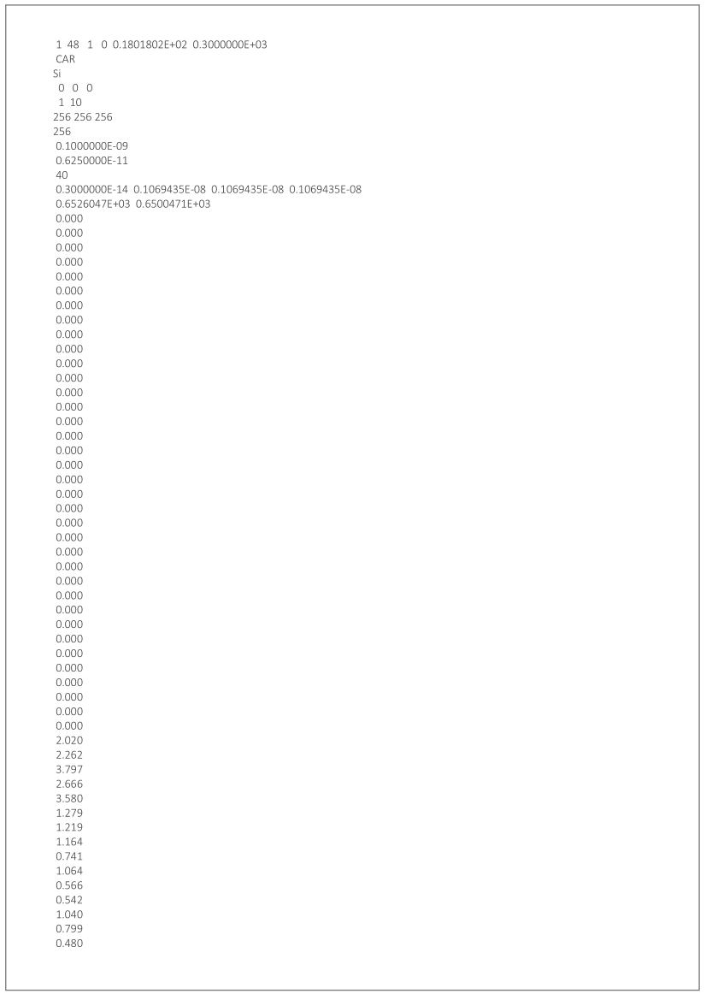

   En demonstrativ bild över utseendet för PCDAT från VASP. Notera att värdena inte riktigt stämmer.
	 
Bilden fig:PCDAT_utseende_ beskriver
utseendet hos en del av PCDAT-filen för PKF för systemet Si i 300K, med
40 olika tidsteg. Viktigaste är den långa kolumnen av siffror som utgör
definitionsmängden till funktionen.

.. _sec:rotgruppstr:

HDF5-format
~~~~~~~~~~~

Vid hantering av stora mängder data, sådana genererade av
beräkningsprogram som VASP, är HDF5-formatet mycket användbart. Det gör
specificiering av olika dataförhållanden och beroenden enkla, samt
tillgängliggör bearbetning av delar av data åt gången.

En HDF5-fil är ett objekt som innehåller en rotgrupp, som äger alla
andra grupper under den. Denna rotgrupp kan symboliseras av
`/`. Exempelvis `/foo/zoo` symboliserar *zoo* som är en medlem
till *group* *foo*, som vidare är en medlem till rotgruppen.
Ett *dataset* kan pekas av flera *groups* [HDFGroup2]_.

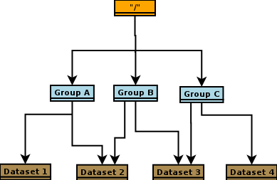

   Schematisk bild över HDF5 struktur

Mer ingående består *dataset*-objektet av metadata och rådata. Metadata
beskriver rådatan, till den ingår *dataspace*, *datatype*, *properties*
och *attributes*. Alla dessa är HDF5-objekt som beskriver olika saker.

*datatype* beskriver vad för datatyp varje individuell dataelement i ett
dataset har. Exempelvis kan detta vara ett 32-bitars heltal, eller ett
32-bitars flyttal. I det mer komplexa fallet kan det också vara en
sammansättning av flera, vanligt benämnda, datatyper. *Datatype*
beskriver då en följd av olika datatyper. Exempelvis en sammansättning
som int16, char, int32, 2x3x2 array av 32-bit floats beskriver att varje
dataelement i det gällande datasetet har en datatyp som består av 16
bitars heltal, en bokstav, 32-bitars heltal och slutligen en array av
flyttal med dimensionen 2x3x2. *dataspace* är en HDF5-objekt som
beskriver hur datasetet sparar sin data, den kan exempelvis vara tom.
Ett dataset kan även bestå av ett enda tal, eller vara en array.
*Properties* är mindre konkret än de två tidigare nämnda egenskaperna
och beskriver minneshanteringen av ett dataset. I dess defaultläge
exempelvist är dataset sparade kontinuerligt. Slutligen återfinns
HDF5-objektet *attributes*, som kan valbart skapas. Typiskt sätt skapas
*attributes* som ett sätt för att ytterligare beskriva några egenskaper
hos ett dataset. En *attribute* innehåller ett namn och ett värde, och
skapas i samband med att ett dataset öppnas [HDF group2]_.

.. figure:: figures/Dataset_Metadata_HDF5.png
   :name: fig:Dataset_Metadata_HDF5
   :align: center
   :width: 50 %
   :figwidth: 50 %
   :alt: Dataset_Metadata_HDF5

   Schematisk bild över *dataset*.

ENVISIoN arbetar med HDF5-formatet. Python ger tillgång till hantering
av HDF5-formatet via paketet *h5py*. Detta tillgängliggör exempelvis
läsandet av specifika element i massiva arrayer med användandet av
syntaxer tillgängliga av paketet *numpy* [HowToUseHDF5FilesinPython]_.

Paketet *h5py* ger upphov till HDF5-filer vilket kan ses som behållare
för två sorters objekt, *datasets* och *groups*. *datasets* är
array-liknande ihopsättning av data, medan *groups* fungerar som
behållare för andra *groups* eller *datasets* [HowToUseHDF5FilesinPython]_. Elementen i
*datasets* kan vara komplexa objekt. *groups* kan återfinnas i andra
*groups*, detta ger därmed möjlighet till konstruktion av grupperingar
av olika sammanhängande data. *groups* och medlemmarna till *groups*
fungerar som mappar och filer i UNIX. Varje *dataset* karaktäriseras
exempelvis av en sökväg [HDFGroup2]_.

 

ENVISIoNs HDF5-fil
------------------

ENVISIoNs parsersystem använder sig av pythonmodulen *h5py* för att
generera en lämplig HDF5-filstruktur vid parsning. Den HDF5-strukturen
som genereras återfinns i nedstående diagram. Notera att figuren visas
som helbild i Appendix sec:appendixHDF5_.

.. figure:: figures/UPDATE-hdf5-dataformat3modi.png
   :name: fig:ENVISIoNsHDF5
   :align: center
   :width: 100%
   :figwidth: 100%
   :alt: ENVISIoNsHDF5

   En bild över HDF5-filstruktur som används i ENVISIoN.

I diagram fig:ENVISIoNsHDF5_ nedan
representeras olika grupper (*groups*) av lådor med pilar (förutom
lådorna vars brödtext är angiven i parantes), de sista lådorna i slutet
av varje förgrening representerar olika *dataset*. Diagrammet beskriver
alltså hur information struktureras i en HDF5-fil som parsersystemet
skapat. För att få tillgång till ett visst *dataset* måste en sökväg
anges. Denna sökväg är inget mer än en sträng bestående av olika grupper
som beskriver hur ett *dataset* nås från rotgruppen, se under rubrik
sec:rotgruppstr_.

Varje *dataset* kan bestå av ett antal olika fältnamn. Det fältnamn som
alltid förekommer är *value*, vilket beskriver den huvudsakliga datan
som datasetet innehåller. Utöver det kan vissa andra fältnamn också
förekomma, exempelvis "VariableName" vilket är olika attribut,
*attributes*, som beskriver andra egenskaper hos *dataset* som kan vara
intressant.

Notera att diagram fig:ENVISIoNsHDF5_ saknar
viss information för DOS. DOS står för Density of States, översatt till
tillståndstäthet. På grund av platsbrist har inte attributen skrivits ut
för DOS. p-DOS, d-DOS(xy), Energy, grupper under DOS, med mera har
attributen

-  VariableName är fältets namn.

-  VariableSymbol är en symbol som representerar variabeln.

-  QuantityName är ett för en människa läsligt namn på fältet.

-  QuantitySymbol är symbol som representerar storheten.

-  Unit är storhetens fysikaliska enhet.

Notera också att *float[x]* avser en lista med längd x, samt att alla
grupper som är märkta med n är en metod att ange att det kan finns flera
grupper på den nivån. Lådor vars rubrik är angivet inom parentes anger
ett villkor för att den resterande sökvägen ska kunna skapas. Viktig
anmärkning här är därför att dessa villkor inte ingår i HDF5-strukturen,
de är inga grupper, och ingår därmed inte med sökvägen till de
respektive dataseten. Under *DOS* förekommer exempelvis en sådan låda
med brödtexten *(LORBIT=0)*, samt under förgreningen hos *DOSPartial*
förekommer en låda med angivelsen *(ISPIN=0)*. Båda *ISPIN* och *LORBIT*
är flaggor som kan sättas i INCAR-filen. I detta fall anger lådorna
villkoren att *(LORBIT=0)* och *(ISPIN=0)* för att den fortsatta
respektive grupperna under ska kunna skapas. Lådan under
*PairCorrelationFunc* anger dock ingen sådan flaggan. Det den anger är
villkoret som har med huruvida *\_write\_pcdat\_onecol* eller
*\_write\_pcdat\_multicol* används.

Parsning av PKF ges av olika möjligheter, parsern behandar en av
följande fall:

#. System av flera atomtyper, det som beräknas är en genomsnittlig PKF
   över alla atomtyper.

#. System av flera atomtyper, det som beräknas är en genomsnittlig PKF
   för varje atomtyp. Ingår det K atomtyper i systemet ska parsern ge
   upphov till K stycken parkorrelationsfunktioner.

#. System av 1 atomtyp.

För fall 2 och 3 används *\_write\_pcdat\_multicol* medan fall 1 använder
*\_write\_pcdat\_onecol*, se under rubrik
sec:skrivning till HDF5_. Villkoren är därmed enbart ett sätt
att ange vad för fall parsern behandlar.

.. _sec:skrivning till HDF5:

Skrivning till HDF5-fil
-----------------------

Det som skapar strukturen i HDF5-filen är skrivningsmodulen *h5writer* I
ENVISIoN. *h5writer.py* är ett skript som innehåller alla
skrivningsfunktioner som ingår i parsersystemet. Funktionernas uppgift
är att skapa *datasets* (rådata) i rätt plats i HDF5-fil objektet. Nedan
listas alla funktioner som ingår i modulen.

**\_write\_coordinates** Denna funktion skriver koordinater för
atompositioner där varje atomslag tilldelas ett eget *dataset*. Attribut
sätts för respektive grundämnesbeteckning per *dataset*.

Parametrar:

-  h5file: Sökväg till HDF5-fil, anges som en sträng.

-  atom\_count: Lista med antalet atomer av de olika atomslagen.

-  coordinates\_list: Lista med koordinater för samtliga atomer.

-  Elements: None eller lista med atomslag.

Returnerar:

-  None

**\_write\_basis** Denna funktion skriver gittervektorerna i ett dataset
med namn basis.

Parametrar:

-  h5file: Sökväg till HDF5-fil, anges som en sträng.

-  basis: Lista med basvektorerna.

Returnerar:

-  None

**\_write\_bandstruct** Denna funktion skriver ut data för bandstruktur i
en grupp med namn Bandstructure. Inom denna grupp tilldelas specifika
K-punkter, energier samt bandstrukturer egna dataset. Diverse attribut
sätts även för bl.a. specifika energier.

Parametrar:

-  h5file: Sökväg till HDF5-fil, anges som en sträng.

-  band\_data: Lista med bandstrukturdata.

-  kval\_list: Lista med K-punkter för specifika bandstrukturdata.

Returnerar:

-  None

**\_write\_dos** Denna funktion skriver ut DOS-data i en grupp med namn
DOS där total och partiell DOS tilldelas grupper med namn Total
respektive Partial. Inom gruppen Total tilldelas energin samt specifika
DOS egna dataset och inom gruppen Partial tilldelas varje partiell DOS
egna grupper där energin samt specifika DOS tilldelas egna dataset.

Parametrar:

-  h5file: Sökväg till HDF5-fil, anges som en sträng.

-  total: En lista med strängar av de olika uträkningarna som har
   utförts av VASP för total DOS.

-  partial: En lista med strängar av de olika uträkningarna som har
   utförts av VASP för partiell DOS.

-  total\_data: En lista med alla beräkningar för total DOS för varje
   specifik atom.

-  partial\_list: En lista med alla beräkningar för partiell DOS för
   varje specifik atom.

-  fermi\_energy: Fermi-energin för den aktuella uträkningen.

Returnerar:

-  None

**\_write\_volume** Denna funktion skriver ut elektrontäthetsdata och
elektronlokaliseringsfunktionsdata (ELF) till grupper med namn CHG
respektive ELF. Inom dessa grupper tilldelas varje iteration ett
dataset.

Parametrar:

-  h5file: Sökväg till HDF5-fil, anges som en sträng.

-  i: Skalär som anger numret på iterationen.

-  partial: En lista med strängar av de olika uträkningarna som har
   utförts av VASP för partiell DOS.

-  array: Array med parsad data för respektive iteration.

-  data\_dim: Lista som anger dimensionen av data för respektive
   iteration.

-  hdfgroup: En textsträng med namnet på vad man vill kalla gruppen i
   HDF5-filen.

Returnerar:

-  None

**\_write\_incar** Denna funktion skriver ut parsad data från INCAR i ett
dataset med namn Incar där varje datatyp tilldelas egna dataset.

Parametrar:

-  h5file: Sökväg till HDF5-fil, anges som en sträng.

-  incar\_data: Datalexikon med all data från INCAR-filen.

Returnerar:

-  None

**\_write\_pcdat\_onecol** Denna funktion skapar ett HDF5-struktur för ett
system med flera atomtyper, där en genomsnittlig PKF beräknas för alla
atomtyper. Funktionen skapar en HDF5-struktur som innehåller data från
huvudsakligen PCDAT.

Parametrar:

-  h5file: Sökväg till HDF5-fil, anges som en sträng.

-  pcdat\_data: Tillhör Python-datatypen *dictionary* [dict]_. Detta argument innehåller alla värden av
   PKF som parsats.

-  APACO\_val: Värdet på APACO-flaggan i VASP-filen INCAR eller POTCAR.
   Defaultvärde är 16 Ångström. Flaggan anger det längsta avståndet
   sista iteration för beräkning av PKF har.

-  NPACO\_val: Värdet på NPACO-flaggan i VASP-filen INCAR eller POTCAR.
   Defaultvärde är 256. Flaggan anger hur många iterationer ska ske för
   beräkning av PKF.

Returnerar:

-  None

**\_write\_pcdat\_multicol** Denna funktion skapar ett HDF5-struktur för
ett system med flera atomtyper, där en genomsnittlig PKF beräknas för
varje atomtyp som ingår i systemet. Funktionen anropas också i fallet då
systemet enbart består av en atomtyp. Funktionen skapar en HDF5-struktur
som innehåller data från huvudsakligen PCDAT.

Parameterar:

-  h5file: Sökväg till HDF5-fil, anges som en sträng.

-  pcdat\_data: Tillhör Python-datatypen *dictionary* [dict]_. Detta argument innehåller alla värden av PKF som parsats.

-  APACO\_val: Värdet på APACO-flaggan i VASP-filen INCAR eller POTCAR.
   Defaultvärde är 16 Ångström. Flaggan anger det längsta avståndet
   sista iteration för beräkning av PKF har.

-  NPACO\_val: Värdet på NPACO-flaggan i VASP-filen INCAR eller POTCAR.
   Defaultvärde är 256. Flaggan anger hur många iterationer ska ske för
   beräkning av PKF.

Returnerar:

-  None

.. _sec:inläsning av VASP:

Inläsning av VASP-filer
-----------------------

Innan en funktion kan skriva till HDF5-objektet krävs det att rätt
inläsning av innehåll från relevant VASP-fil har skett. Detta är vad de
olika läsningsfunktionerna i parsersystemet gör. Typiskt återfinns en
pythonmodul för varje egenskap hos ett system som ska parsas. Nedan
listas alla sådana moduler.

Incarparser
~~~~~~~~~~~

Incarparsern består av en pythonfil med namnet incar som innehåller
funktionerna, incar och parse\_incar. Dessa funktioner läser in och
sparar information från INCAR-filen samt anropar en separat pythonmodul
som skriver en HDF5-fil.

Funktionen incar kontrollerar att HDF5-filen redan innehåller INCAR-data
och anropar funktionen parse\_incar om så inte är fallet. Existerar
INCAR-filen i användarens VASP-katalog parsas data av funktionen
parse\_incar som då sparar ett dataset för varje datatyp och namnger
dataseten därefter. Funktionen incar anropar sedan pythonmodulen som
skriver HDF5-filen där varje enskilt *dataset* tilldelas en egen grupp.

Funktionsanrop: envision.parser.vasp.incar(h5file, vasp\_dir)

Parameterar:

-  h5file: Sökväg till HDF5-fil, anges som en sträng.

-  vasp\_dir: Sökväg till VASP-katalog, anges som en sträng.

Returnerar:

-  Lista med namn på data (*datasets*) som parsas.

-  Bool: True om parsning skett felfritt, False annars.

Volymparser
~~~~~~~~~~~

Volymparsern består av en mängd funktioner i en pythonfil som används
för parsning av CHG och ELFCAR. Den kan läsa in och spara data på
HDF5-format från båda dessa filer genom att anropa en pythonmodul. Detta
är för att CHG och ELFCAR har samma struktur och består av ett antal
iterationer av volymdata från volymberäkningar. Således innehåller den
sista iterationen data som är mest korrekt. Därför skapar volymparsern
också en länk till den sista iterationen i HDF5-filen för att data av
högst kvalitet lätt ska kunna plockas ut.

Funktionsanrop vid parsning av CHG-data:
envision.parser.vasp.charge(h5file, vasp\_dir)

Funktionsanrop vid parsning av ELFCAR-data:
envision.parser.vasp.elf(h5file, vasp\_dir)

Parameterar:

-  h5file: Sökväg till HDF5-fil, anges som en sträng.

-  vasp\_dir: Sökväg till VASP-katalog.

Returnerar:

-  Bool: True om parsning skett felfritt, False annars.

Tillståndstäthetsparser
~~~~~~~~~~~~~~~~~~~~~~~

Tillståndstäthetsparsern består av en mängd funktioner i en pythonfil
som används för parsning av DOSCAR. DOSCAR-filen består först av den
totala tillståndstätheten och sedan partiell tillståndstäthet för
varje atom i kristallen. Beroende på vad som står i INCAR kan dock denna
data se väldigt olika ut. Flaggorna ISPIN, RWIGS och LORBIT i
INCAR-filen avgör vad som skrivs i DOSCAR-filen. ISPIN-flaggan
informerar om spinn har tagits hänsyn till vid beräkningar,
RWIGS-flaggan specificerar Wigner-Seitz-radien för varje atomtyp och
LORBIT-flaggan (kombinerat med RWIGS) avgör om PROCAR- eller
PROOUT-filer (som DOSCAR-filen refererar till) skrivs. Parsern läser
därför från data givet av incarparsern i HDF5-filen för att se hur
DOSCAR ska parsas. Parsern delar upp data i två grupper i HDF5-filen,
total och partiell. I gruppen partiell finns det en grupp för varje
atom. Ett dataset för varje undersökt fenomen skrivs sedan ut för varje
atom under partiell, och för total tillståndstäthet under total.

Funktionsanrop: envision.parser.vasp.dos(h5file, vasp\_dir)

Parameterar:

-  h5file: Sökväg till HDF5-fil, anges som en sträng.

-  vasp\_dir: Sökväg till VASP-katalog.

Returnerar:

-  Bool: True om parsning skett felfritt, False annars.

Enhetscellsparser
~~~~~~~~~~~~~~~~~

Enhetscellparsern läser in gittervektorer, som multipliceras med
skalfaktorn och skrivs till /basis i HDF5-filen. Atompositioner läses
från POSCAR och om dessa är angivna med kartesiska koordinater räknas de
om till koordinater med gittervektorerna som bas. Koordinaterna skrivs
till HDF5-filen uppdelade efter atomslag och attribut sätts med
respektive grundämnesbeteckning. Om dessa inte ges med parametern
elements letar parsern i första hand i POTCAR och i andra hand i POSCAR.

Funktionsanrop: envision.parser.vasp.unitcell(h5file, vasp\_dir, elements
= None)

Parameterar:

-  h5file: Sökväg till HDF5-fil, anges som en sträng.

-  vasp\_dir: Sökväg till VASP-katalog.

-  elements = None: None eller lista med atomslag.

Returnerar:

-  Bool: True om parsning skett felfritt, False annars.

Parkorrelationsfunktionsparser
~~~~~~~~~~~~~~~~~~~~~~~~~~~~~~

Parkorrelationsfunktionsparser använder sig av ett antal olika
funktioner, vilka alla anropas med funktionen *paircorrelation(h5file,
vasp\_dir)*. Parsningen görs genom inläsning av korrekt data från
PCDAT-filen, samt inläsning av flaggor som NPACO och APACO. Parsen letar
efter dessa flaggor i INCAR eller POTCAR för att se om de är satta. I
fallet de inte är det antas deras defaultvärden.

Funktionsanrop: envision.parser.vasp.paircorrelation(h5file, vasp\_dir)

Parameterar:

-  h5file: Sökväg till HDF5-fil, anges som en sträng.

-  vasp\_dir: Sökväg till VASP-katalog.

Returnerar:

-  Bool: True om parsning skett felfritt. Ett undantag kan kastas om
   PCDAT-fil inte hittas.

parse\_all
~~~~~~~~~~

parse\_all är en funktion för parsning av allt som finns i katalogen som
ges som inparameter. Funktionen kallar på alla systemets parsers och
skriver ut meddelande om vad som parsas och om parsningen gjordes eller
ej.

Funktionsanrop: envision.parse\_all(h5\_path, dir)

Parameterar:

-  h5\_path: Sökväg till HDF5-fil, anges som en sträng.

-  vasp\_dir: Sökväg till katalog med utdata-filer från
   beräkningsprogram.

Returnerar:

-  Bool: True om parsning skett felfritt, False annars.

Testning
--------

För att varje års projekt ska kunna kontrollera att alla parsersystem
fungerar är det viktigt med testfiler. Detta kan också ge inblick i hur
parsern är tänkt att fungera. En generell testmapp i ENVISIONs
filstruktur för parsersystemet finns. Mappen innehåller för tillfället
enbart tester för parsersystemet för PKF (det är både skrivning och
läsningsfunktioner som testas). Testfiler för PKF parsern skapades med
hjälp av pythonmodulen *unittest*  [Unittest]_. Detta
test testar bland annat undantagshanteringen och viktiga returvärden hos
olika funktioner hos parsersystemet för PKF. Testet kontrollerar
exempelvis att parsersystemet kan hantera PCDAT-filer av olika
utseenden.

Test för parsersystemet för PKF har implementerats med en testfil med
namnet *test\_paircorrelation.py* samt en mapp vid namn *testdata*. I
*testdata* finns det olika mappar med VASP-filer för olika system, som
därmed testar att parsern fungerar korrekt för olika filer. Det är
tanken att framtida utvecklare använder sig av denna mapp för att lägga
in tester för nyskapade funktioner för parsning av någon ny egenskap.

Visualiseringssystemet
======================

Visualiseringssystemet är det delsystem som använder den HDF5-fil som
parsersystemet genererar för att visualisera beräkningsresultaten. Detta
görs genom olika nätverk, bestående av processorer. Nedstående kapitel
redovisar de olika befintliga nätverk ENVISIoN består av.

Nätverk
-------

För att visualiseringssytemet ska vara kompatibelt med den
HDF5-strukturen som parsersystemet genererar kommer utseendet hos
nätverken att se olika ut för varje visualisering. Nedan återfinns olika
nätverk som olika skript genererar för olika visualiseringar.

Nätverk för visualisering av parkorrelationsfunktionen
~~~~~~~~~~~~~~~~~~~~~~~~~~~~~~~~~~~~~~~~~~~~~~~~~~~~~~

Ett nytt skript med processorer för visualisering av
parkorrelationsfunktionen har utvecklats. Det nätverk som skapas av
skriptet visas i figur fig:PCF_.

.. figure:: figures/PCF.png
   :name: fig:PCF
   :align: center
   :width: 100 %
   :figwidth: 100 %
   :alt: PCF

   Nätverk för parkorrelationsfunktion.

Nätverket startar med att öppna en HDF5-fil. Efter det kontrollerats om
gruppen *PairCorrelationFunc* finns i den parsade filen med hjälp av
*HDF5PathSelection*-processorn. Därefter läggs det till en
*HDF5ToFunction*-processor som extraherar den parsade datan och gör om
det till en funktion. Nästkommande processorn, dvs *LinePlot*, används
för att rita upp den data som tas emot från föregående processron. En
mesh byggs upp med hjälp av *MeshRenderer*-processorn,
*Background*-processorn bygger upp bakgrunden och
*TextOverlay*-processorn används för att skriva ut text till canvasen.
Figur fig:PCF_ och fig:network_ demonstrerar ett exempel på ett nätverk och respektive 2D-graf som visualiserar paircorrelation funktionen för Si med 40 steg i
temperaturen 300K. Observera att alla *HDF5ToFunction*-processorer inte
syns i figur fig:PCF_. Den 2D-grafen som genereras av
nätverken visas i figur fig:PCF_.

.. figure:: figures/network.png
   :name: fig:network
   :align: center
   :width: 100 %
   :figwidth: 70 %
   :alt: network

   2D-graf från parkorrelationsfunktion.

Bandstruktur
~~~~~~~~~~~~

Nätverket startar med att öppna en HDF5-fil. Därefter kontrolleras om
det finns en sökväg med namnet *Fermienergy* i filen, skulle sökvägen
existera läggs en processor till som extraherar det värdet sparat i ett
dataset. Sedan navigeras det genom HDF5-filen till platsen där alla band
är sparade. Alla dessa band sparas i en DataFrame där varje kolumn
innehåller alla värden för ett band. Skulle Fermienegin finnas i
HDF5-filen kommer det värdet att subtraheras från alla värden i
DataFrame. Sedan ritas alla band upp i en graf med samma värden på
x-axeln. y-axeln får en rubrik med lämplig text, antigen *Energy* eller
*Energy - Fermi energy*, för att sedan visualiseras i ett fönster.

Med den kunskapen gruppmedlemmarna besitter idag skulle inte samma
tillvägagångssätt för visualiseringen tagits. Kontrollen av fermienergi
skulle ske redan i parsern för bandstrukturen. Skulle Fermienergin
hittas, subtraheras värdet redan innan all data för de olika banden
lagras i ett dataset.

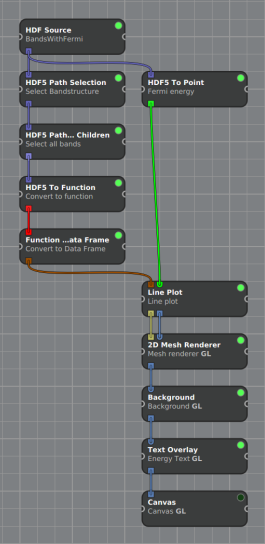

   Nätverk för visualisering av bandstruktur.
	   
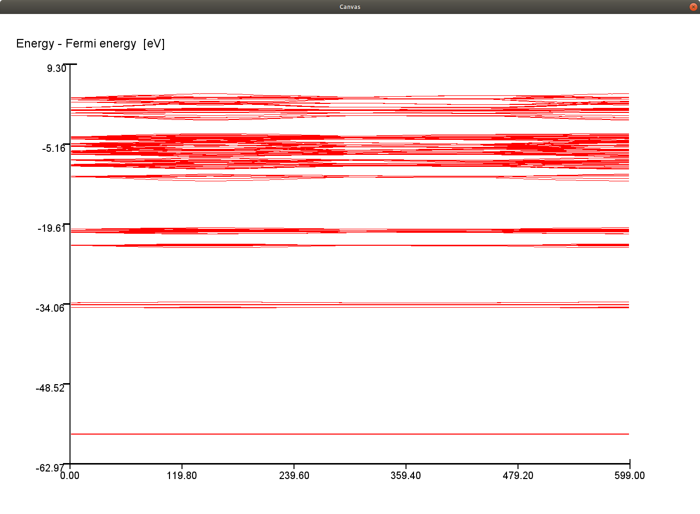
	 
.. image:: figures/ZoomedBands.png
   :alt: ZoomedBands
   :width: 49%
	      
.. _fig:bands_tipo4:

*Visualisering av bandstruktur för TiPO4.
(vänster) Visualisering av hela bandstrukturen som skapas när nätverket evalueras.
(höger) En förstoring där endast energin mellan -4 eV och 5 eV visas.*

Tillståndstäthet
~~~~~~~~~~~~~~~~

Nätverket för visualisering av tillståndstäthetsdata laddar en
*HDFSource*-processor som anger HDF5-filen som data laddas från. Sedan
kopplas en *HDF5PathSelection*-processor, som tar ut den givna
HDF5-gruppens alla undergrupper direkt till den redan befintliga
*HDFSource*-processorn. Denna processor anger att data ska laddas från
DOS-gruppen i HDF5-filen. Två till *HDF5PathSelection*-processorer
laddas sedan som anger grupperna Total och Partial i HDF5-filen.

För Total-delen laddas sedan kontinuerligt *HDF5ToFunction*-processorer
som gör funktioner av all data i Total-gruppen. För Partial-gruppen
laddas en *HDF5PathSelection*-processor som tar ut dataset för en vald
atom genom att välja den givna HDF5-filens relevanta undergrupp. Denna
processor har namnet *Partial Pick* i nätverket. Därefter laddas
*HDF5ToFunction*-processorer för alla dataset i grupperna under
Partial-gruppen. All data matas sedan in i en *LinePlot*-processor som
gör en 2D-graf. Detta matas in i en *Canvas*-processor som visar själva
grafen. Dessutom finns två textOverlay processorer som skriver ut text
för x- och y-axeln. Figur fig:DoS_ visar total
tillståndstäthet för titanfosfat, TiPO4. Figur
fig:DoSNetwork_ visar nätverket som ger 2D-grafen
i figur fig:DoS_. Användaren kan även välja att visa en
2D-graf av den partiella tillståndstätheten med hjälp av sammma nätverk.

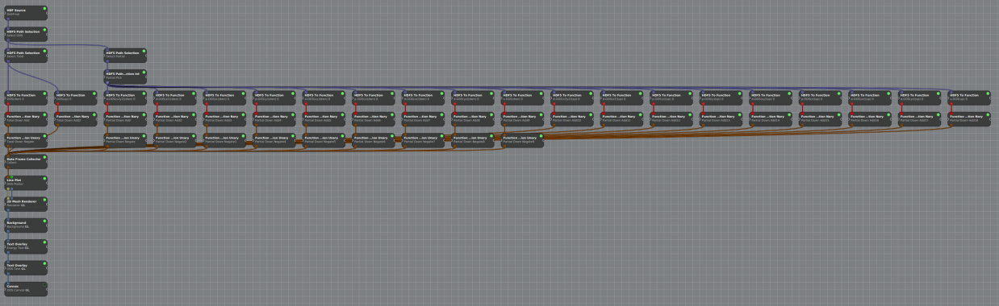
      
   Nätverk för visualisering av tillståndstäthet.

.. _fig:DoS:	 
   
.. image:: figures/TotalDoS.png
   :alt: TotalDos
   :width: 49%
	      
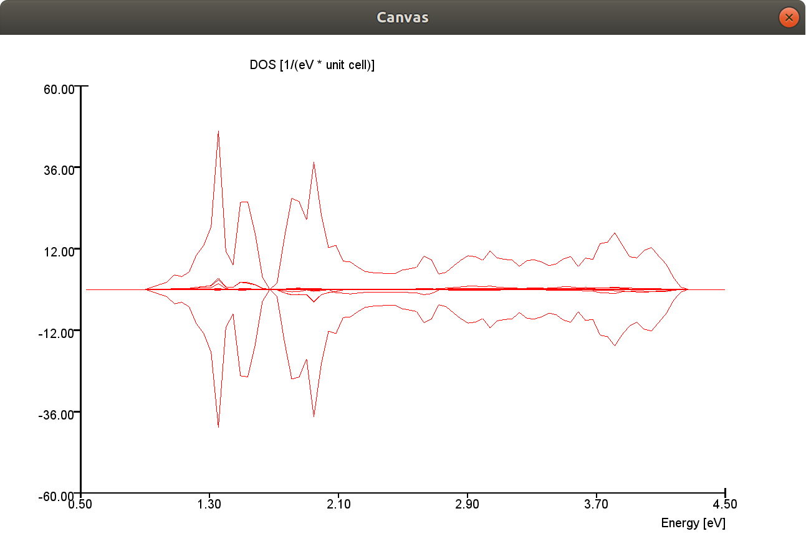

*Visualisering av tillståndstätheten för TiPO4.
(vänster) Visualisering av den totala tillståndstätheten med en blå hjälplinje för avläsning.
(höger) Förstoring av visualiseringen av den totala tillståndstätheten.*

.. _sec:NetworkHandlers:

NetworkHandlers
---------------

För att andra delsystem enkelt ska kunna sätta upp och ändra parametrar
i inviwonätverken så har python-klasser, kallade *NetworkHandlers*,
skrivits. Dessa klasser initierar specifika delar av nätverket och har
funktioner för att ändra speciella properties i de processorer de har
ansvar över. *NetworkHandlers* finns för nuvarande inte för alla
visualiseringar utan bara för de relaterade till volymrendering.

VolumeNetworkHandler
~~~~~~~~~~~~~~~~~~~~

En klass som sätter upp ett generiskt nätverk för volymrendering.
Nätverket som byggs upp kan inte självstående ge upphåv till någon
visualisering då ingen volymdatakälla initieras. Detta måste istället
göras från en mer specificerad *VolumeHandler*-klass som ärver denna.

.. figure:: figures/VolumeHandler/volume_network_ex.PNG
   :name: fig:VolumeNetworkHandler
   :align: center
   :width: 100 %
   :figwidth: 70 %
   :alt: VolumeNetworkHandler

   Nätverket som byggs upp då en VolumeNetworkHandler-instans initieras.

Som visas i figur
fig:VolumeNetworkHandler_ så kan
nätverket delas upp i två delar. En volymrenderingsdel och en
tvärsnittsrenderingsdel.

Processorerna *Cube Proxy Geometry*, *Entry Exit Points*, och *Volume
Raycaster*, visade i mitten av figur
fig:VolumeNetworkHandler_ kommer att
generera bilddata direkt baserat på den volymdata de tar emot.

Processorerna *Volume Bounding Box* och *Mesh Renderer* visade i högra
delen av figur
fig:VolumeNetworkHandler_ kommer att
generera bilddata av den parallellepiped som stänger in volymen.
Bilddatan skickas sedan till *Volume Raycaster* och sammanfogas där med
bilddatan av volymen. Detta skickas sedan till *Volume
Background*-processorn där en bakgrund adderas till bilddatan som sedan
skickas till *Canvas*-processorn där den slutgiltiga visualiseringen
visas.

Tvärsnittsrenderingen tar emot samma volymdata som volymrenderingen,
skickar det till *Volume Slice*-processorn, vilken genererar bilddata
baserat på ett plan som skär volymen. Bilddatan skickas sedan till en
egen canvas. Volymrenderingens *Raycaster*-processor har förmågan att
rita ut ett plan på en godtycklig position i volymen. Detta plan länkas
till planet i *Volume Slice*-processorn så att ett delvis transparent
plan ritas i volymen på samma position som planet *Volume Slice*
använder sig av för att hämta sin data. Tvärsnittsrenderingen kan
aktiveras och inaktiveras genom att dess *Canvas*-processor raderas
eller läggs till, och att planrenderingen i *Raycaster*-processorn
aktiveras eller inaktiveras. Viktiga funktioner i
*VolumeNetworkHandler*:

-  **setup\_volume\_network:** Bygger upp nätverket som visat i figur
   fig:VolumeNetworkHandler_. Notera
   att volyminportarna ej är anslutna.

-  **connect\_volume:** Ansluter alla volym-inportarna till en
   specificerad volym-outport. Detta måste göras innan en visualisering
   ska köras, annars har nätverket ingen volymdata att visualisera.

-  **show\_volume\_dist:** Ritar upp ett nytt fönster med ett histogram
   över volymdistributionen i en specificerad HDF5-fil.

-  **toggle\_slice\_canvas:** Tar bort eller lägger till *Slice
   Canvas*-processorn. För att aktivera eller inaktivera
   tvärsnittsrenderingen.

Förutom dessa funktioner har *VolumeNetworkHandler* funktioner för att
ändra properties hos de processorer den initierat.

UnitcellNetworkHandler
~~~~~~~~~~~~~~~~~~~~~~

En klass som sätter upp ett och hanterar nätverk för
atompositionsrendering. Nätverket som sätts upp kan självstående
generera en visualisering för bara atompotitioner men kan också
kombineras med andra nätverk genom att denna ärvs i mer specificerade
*NetworkHandler*-klasser.

.. figure:: figures/VolumeHandler/unitcell_network.PNG
   :name: fig:unitcell_network
   :align: center
   :width: 100 %
   :figwidth: 50 %
   :alt: unitcell_network

   Nätverket som byggs upp då en UnitcellNetworkHandler-instans initieras.

.. figure:: figures/VolumeHandler/unitcell_vis.PNG
   :name: fig:unitcell_vis
   :align: center
   :width: 100 %
   :figwidth: 50 %
   :alt: unitcell_vis

   Resulterande bild från nätverk i figur fig:unitcell_network_

*UnitcellNetworkHandler* börjar med kontrollera att den givna HDF5-filen
har data för en atompositionsvisualisering och kastar ett
*AssertionError* om den inte har det. Den fortsätter sedan med att sätta
upp en *HDF5 Source*-processor, om en sådan redan existerar så används
den existerande processorn istället. Vilka atomtyper som HDF5-filen
innehåller information om läses sedan.

En *Coordinate Reader*-processor för varje atomtyp läggs till.
Koordinatdatan skickas vidare till en *Structure Mesh*-processor, en
ENVISIoN processor som konverterar koordinaterna till en *mesh*. Meshen
skickas till *Sphere Renderer* där den konverteras till bilddata med en
sfär vid varje tidigare koordinat. Bilddatan ritas sedan ut på en
*Canvas*.

Viktiga funktioner i *UnitcellNetworkHandler*:

-  **setup\_unitcell\_network:** Bygger upp nätverket som visat i figur
   fig:unitcell_network_.

Förutom dessa funktioner har *UnitcellNetworkHandler* funktioner för att
ändra properties hos de processorer den initierat.

ChargeNetworkHandler
~~~~~~~~~~~~~~~~~~~~

En specificerad klass för att sätta upp och hantera
laddningstäthetsvisualiseringen. Klassen genererar ett fullständigt
nätverk för laddningstäthetsvisualisering och har funktioner för att
alla parameterändringar som där behövs. Ärver *UnitcellNetworkHandler*
och *VolumeNetworkHandler* för att hantera atompositions- respektive
volymrenderingsaspekten av visualiseringen.

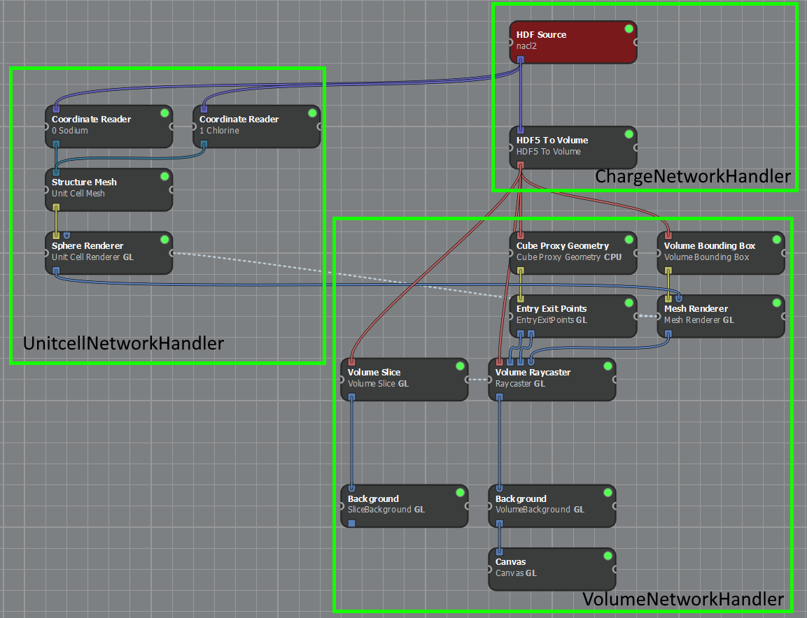

   Nätverket som byggs upp då en ChargeNetworkHandler-instans initieras och HDF5-filen innehåller unitcell-data.

.. figure:: figures/VolumeHandler/charge_vis.PNG
   :name: fig:charge_vis
   :align: center
   :width: 100 %
   :figwidth: 50 %
   :alt: charge_vis

   Resulterande bild från nätverk i figur fig:charge_network_.

*ChargeNetworkHandler* börjar med kontrollera att den givna HDF5-filen
har data för en laddningstäthetsvisualisering och kastar ett
*AssertionError* om den inte har det. Den fortsätter sedan med att
initera sina superklasser *VolumeNetworkHandler* och
*UnitcellNetworkHandler*. Dessa sätter up sina delar av nätverket som
indikerat i figur fig:charge_network_.

En *HDF5 Source* sätts upp, denna ansluts till unitcell-delen av
nätverket. En *HDF5 To Volume* sätts upp och anslutes till *HDF5
Source*. *HDF5 To Volume* hämtar ut volymdata från HDF5-filens */CHG/*
sökväg. Processorn genererar volymdata som i sin tur ansluts med
volymrenderingsdelens volymdatainportar.

 

Bilddatautporten från *Sphere Renderer* ansluts till *Mesh Renderer*.
Detta gör att bilderna från de två processorerna slås samman och att
både atompoisitoner och volymdata renderas i samma fönster. Även *Sphere
Renderer*-processorns *Camera*-property ansluts till *Mesh Renderer* för
att kameravinklarna ska vara identiska.

*ChargeNetworkHandler* inaktiverar som standard *Slice Canvas*:en och
*Unitcell Canvas*:en. Dessa kan återaktiveras via sina respektive
funktioner igen, exempelvis då en knapp i det grafiska gränssnittet
klickas på.

Om HDF5-filen inte innehåller unitcell-data så kan
*UnitcellNetworkHandler* inte initieras och kastar ett exception. Endast
volymrenderingsdelen av visualiseringen initieras då och
atompositionsvisualiseringen ignoreras.

Viktiga funktioner i *ChargeNetworkHandler*:

-  **setup\_charge\_network:** Bygger upp nätverket som visat i figur
   fig:charge_network_.

-  **get\_available\_bands:** Returnerar en lista med de möjliga bandvalen
   som är möjliga i HDF5-filen.

Förutom dessa funktioner har *ChargeNetworkHandler* funktioner för att
ändra properties hos de processorer den initierat.

ELFNetworkHandler
~~~~~~~~~~~~~~~~~

ELFNetworkHandler är identisk i jämförelse med ChargeNetworkHandler med
ett fåtal skillnader. Volymdata från HDF5-filen hämtas från sökvägen
*/ELF/* istället för */CHG/*. Detta gör att funktioner för att hämta och
sätta aktiva band också är olika.

ParchgNetworkHandler
~~~~~~~~~~~~~~~~~~~~

En specificerad klass för att sätta upp och hantera visualiseringen för
partiell laddningstäthet. Ärver *VolumeNetworkHandler* och
*UnitcellNetworkHandler* för att hantera volymrenderingsaspekten
respektive atompositionsaspekten av visualiseringen.

.. figure:: figures/VolumeHandler/parchg_network_ex.png
   :name: fig:parchg_network
   :align: center
   :width: 100 %
   :figwidth: 60 %
   :alt: parchg_network

   Nätverket som byggs av ParchgNetworkHandler (utan atompositionsrendering).

Till att börja med initieras superklassen *VolumeNetworkHandler* detta
sätter upp det generiska volymrenderingsnätverket.

Efter detta initieras volymdatakällan och volymdataoutporten ansluts
till volymrenderingsdelen av nätverket.

Volymkällan är här mer komplicerad i jämförelse mot övriga
visualiseringar, eftersom flera olika volymdataset här ska visualiseras
som en volym. Precis hur denna del ser ut beror på de bandval som görs
av användaren.

.. figure:: figures/VolumeHandler/parchg_source_ex.png
   :name: fig:parchg_source
   :align: center
   :width: 100 %
   :figwidth: 50 %
   :alt: parchg_source

   Exempel på nätverkets volymdatakälla med ett bandval för varje läge.

Den partiella laddningstäthetsvisualiseringen tillåter användaren att
välja ett godtyckligt antal band som ska visualiseras och ett av fyra
olika lägen för varje band. Dessa lägen är *Total*, *Magnetic*,
*Up-spin*, och *Down-spin*. De olika lägena hämtar ut volymdata ur
HDF5-filen på olika sätt.

-  **Total:** Hämtar direkt volymdatan från det valda bandets */total/*
   sökväg.

-  **Magnetic:** Hämtar direkt volymdatan från det valda bandets
   */magnetic/* sökväg.

-  **Up-spin:** Hämtar ut både */total/* och */magnetic/* volymdatan som
   *v1* och *v2*. Volymerna summeras sedan med formeln *0.5*(v1+v2)*

-  **Down-spin:** Hämtar ut både */total/* och */magnetic/* volymdatan
   som *v1* och *v2*. Volymerna summeras sedan med formeln *0.5*(v1-v2)*

Volymdatan från de olika bandvalen kombineras sedan med en *Volume
Merger*-processor. *Volume Merger* kan summerar upp till fyra volymer
till en. Om mer än fyra bandval har gjorts så används flera lager av
*Volume Merger*-processorer för att kunna summera alla dessa till en.
Volymdatan från den sista *Volume Merger* skickas sedan till
volymrenderingsnätverket.

Viktiga funktioner i *ParchgNetworkHandler*:

-  **setup\_hdf5\_source:** Initierar *HDF Source*-processorn

-  **setup\_band\_processors:** Sätter upp nätverket som hämtar ut och
   kombinerar volymdata baserat på bandval och lägen. Funktionen kan
   kallas flera gånger efter att nätverket har startats för att byta
   bandval och lägen.

 

Plannerade NetworkHandlers
~~~~~~~~~~~~~~~~~~~~~~~~~~

NetworkHandler-klasser har inte skrivits för alla visualiseringar, de
gamla visualiseringsskripten används fortfarande för att starta de
tvådimensionella visualiseringarna. För att underlätta underhåll av
systemet så bör dessa färdigställas i framtiden. I nuläget finns
funktionaliteten för att starta och styra dessa visualiseringar utspridd
mellan flera olika filer på olika platser.

-  **LinePlotNetworkHandler:** Skulle hantera den generella delen av en
   2D-graf visualisering. Styr allt som har med 2D-grafen att göras, som
   skalning, axlar på grafen, med mera.

-  **BandstructureNetworkHandler:** Ärver LinePlotNetworkHandler och
   sätter upp den specifika delen för bandstructure visualiseringen.
   Skulle styra HDF5-källan och bandval.

-  **DOSNetworkHandler:** Ärver LinePlotNetworkHandler och
   UnitcellNetworkHandler och sätter upp den specifika delen för
   tillståndstäthets visualiseringen. Skulle styra HDF5-källan och val
   av tillstånd.

-  **PCFNetworkHandler:** Ärver LinePlotNetworkHandler och sätter upp
   den specifika delen för parkorrelationsfunktions
   visualiseringen.Skulle styra HDF5-källan och val av tidssteg.

 

.. _sec:datastrukturer:

Datastrukturer
--------------

Två datastrukturer, Point och Function, har introducerats. En
datastruktur är en form av behållare av olika typer av data som kan
skickas mellan processorer. Dessa används i vissa av de implementerade
processorerna.

Point
~~~~~

Denna datatyp representerar en reell 1D-punkt och inkapslar punktens
värde (ett flyttal) samt variabel metadata.

Function
~~~~~~~~

Denna datatyp representerar en reellvärd funktion av en reell variabel
och inkapslar sampelvärden och variabel-metadata för x- och y-axlarna.

.. _sec:processorer:

Processorer
-----------

För att kunna omvandla den data som översatts från VASP-beräkningar till
en visualisering krävs processorer som utför specifika uppgifter. Figur
2 demonstrerar ett typiskt utseende på en processor.

.. figure:: figures/processor.png
   :name: fig:processor
   :align: center
   :width: 100%
   :figwidth: 25%
   :alt: ENVISIoNsHDF5

   Exempel på en processors utseende.
	 
De färgade rutorna till vänster på processorn i figur fig:processor_
är olika typer av ingångar och utgångar. Cirkeln i det övre högra hörnet
på processorn i samma figur är en lampa som lyser då processorn är
aktiv. De processorer som ENVISIoN skapat kategoriseras och beskrivs
nedan.

.. _ch:kristallstruktur-processorer:

Kristallstruktur
~~~~~~~~~~~~~~~~

Nedanstående processorer är relaterade till visualiseringen av
kristallstrukturer. De tillhör en modul vid namn Crystalvisualization.

**CoordinateReader** Från en HDF5-fil läser denna processor koordinater
för atompositioner. En sökväg till ett dataset sätts via en
StringProperty. Utdata från CoordinateReader är *n* stycken vec3.

Inport:

-  Hdf5::Inport inport\_

Utport:

-  DataOutport< std::vector<vec3> > outport\_

Properties:

-  StringProperty path\_

**StructureMesh** Atompostionsdata kopplas ihop med rätt atomfärg och
radie med StructureMesh-processorn. StructureMesh har en multiinport,
dit en eller flera CoordinateReader-processorer kan kopplas in. Indata
för StructureMesh är atompositionsdata i form av vec3 för varje
atomslag. Till denna indata läggs properties för färg, radie och antal
till för varje atomslag/processor som kopplas in. Den ger en mesh, som
har buffrar för position, färg och radie.

Inport:

-  DataInport< std::vector<vec3>, 0> structure\_

Utport:

-  MeshOutport mesh\_

Properties:

-  FloatProperty scalingFactor\_

-  FloatMat3Property basis\_

-  BoolProperty fullMesh\_

-  IntProperty timestep\_

-  std::vector< std::unique\_ptr<FloatVec4Property> > colors\_: vektor som
   innehåller färgproperty för varje atomslag

-  std::vector< std::unique\_ptr<FloatProperty > > radii\_: vektor som
   innehåller radieproperty för varje atomslag

-  std::vector< std::unique\_ptr<IntProperty> > num\_: vektor som
   innehåller antalet atomer per tidssteg för varje atomslag

-  BoolProperty enablePicking\_: sann då picking-funktionen är påslagen

-  IntVectorProperty inds\_: vektor med index på valda atomer

.. _ch:hdf5-processorer:

HDF5
~~~~

Nedanstående processorer är ämnade att fungera väl med de
HDF5-relaterade processorer som är inkluderade i Inviwo.

**HDF5PathSelection\*** Detta är en grupp av processorer som har
funktionalitet liknande den inbyggda processorn HDF5PathSelection. En
eller flera av dessa processorer placeras med fördel mellan en HDFSource
och en eller flera HDF5To*.

Gemensamt för dessa processorer är att de på inporten tar en Hdf5-grupp
och på utporten skriver noll eller flera av dessa omedelbara
undergrupper.

Nedan beskrivs de olika processorerna i denna grupp.

**HDFpathSelectionInt** Denna processor väljer en HDF5-grupp med
heltalsnamn, baserat på värdet på processorns intProperty\_, eventuellt
utökat med ledande nollor till bredden specificerat på processorns
zeroPadWidthProperty\_.

HDF5PathSelectionInt kan med fördel användas tillsammans med en
OrdinalPropertyAnimator för att plocka ut relevant data ur en HDF5-fil.

Anledningen till att utdata ges som en vektor av HDF5-grupper, trots att
processorn alltid skriver exakt en grupp på utporten, är att processorn
ska följa samma mönster som, och fungera väl med, resterande
processorer.

Inport:

-  DataInport<hdf5::Handle> hdf5HandleInport\_

Utport:

-  DataOutport< std::vector<hdf5::Handle> > hdf5HandleVectorOutport\_

Properties:

-  IntProperty intProperty\_

-  IntSizeTProperty zeroPadWidthProperty\_

**HDF5PathSelectionIntVector** Denna processor väljer noll eller flera
HDF5-grupper med heltalsnamn, baserat på värdet på processorns
intVectorProperty\_, eventuellt utökat med ledande nollor till berdden
specificerat av processorns zeroPadWidthProperty\_.

HDF5PathSelectionIntVector kan med fördel användas tillsammans med
”picking” för att plocka ut relevant data ur en HDF5-fil.

Inport:

-  DataInport<hdf5::Handle> hdf5HandleInport\_

Utport:

-  DataOutport< std::vector<hdf5::Handle> > hdf5HandleVectorOutport\_

Properties:

-  IntVectorProperty intVectorProperty\_

-  IntSizeTProperty zeroPadWidthProperty\_

**HDF5PathSelectionAllChildren** Denna processor väljer den givna
HDF5-gruppens alla undergrupper.

Inport:

-  DataInport<hdf5::Handle> hdf5HandleInport\_

**HDF5To\*** Detta är en grupp av processorer som har funktionalitet
liknande den inbyggda processorn HDF5ToVolume. Processorerna placeras
med fördel efter en HDFSource-processor, med en eller flera mellan
liggande HDF5PathSelection*.

Gemensamt för dessa är att de som indata tar noll eller flera
HDF5-grupper (baserat på \*pathSelectionProperty\_), plockar ut dataset
för varje grupp och omvandlar dessa till relevanta objekt (Point eller
Function) som sedan skrivs till utporten. Objektens variabel-metadata
tas, om de finns tillgängliga, från attributen associerade med
dataseten. Vidare kan, om så väljs med \*namePrependParentsProperty\_,
metadat utökas med namnen på de grupper var i dataseten ligger.

Vilka dataset som kan väljas med \*pathSelectionProperty\_ uppdateras
dynamiskt beroende på vilka grupper som ligger på inporten. När ett
lämpligt dataset valts kan \*pathFreezeProperty\_ användas för att
stänga av denna dynamik, så att värdet sparas även om grupperna på
inporten (antagligen tillfälligt) ändras. Detta underlättar manuellt
experimenterande samt användandet av processorer som tillfälligt ger
noll grupper som utadat, t.ex. HDF5PathSelectionIntVector.

**HDF5ToPoint** Denna processor konverterar HDF5-data till noll eller
flera Point-objekt.

Inport:

-  DataInport<hdf5::Handle, 0, true> hdf5HandleFlatMultiInport\_

Utport:

-  DataOutport< std::vector<Point> > pointVectorOutport\_

Properties:

-  OptionPropertyString pathSelectionProperty\_

-  BoolProperty pathFreezeProperty\_

-  IntSizeTProperty namePrependParentsProperty\_

**HDF5ToFunction** Denna processor konverterar HDF5-data till noll eller
flera Function-objekt.

Normalt plockas två dataset per grupp ut, ett för x-axeln och ett för
y-axeln. Om endast data för y-axeln finns tillgänglig kan
implicitXProperty\_ sättas, varvid processorn automatgenererar data för
x-axeln.

Inport:

-  DataInport<hdf5::Handle, 0, true> hdf5HandleFlatMultiInport\_

 

Utport:

-  DataOutport< std::vector<Function> > functionVectorOutport\_

Properties:

-  BoolProperty implicitXProperty\_

-  OptionPropertyString xPathSelectionProperty\_

-  OptionPropertyString yPathSelectionProperty\_

-  BoolProperty xPathFreezeProperty\_

-  BoolProperty yPathFreezeProperty\_

-  IntSizeTProperty xNamePrependParentsProperty\_

-  IntSizeTProperty yNamePrependParentsProperty\_

.. _ch:2d-processorer:

2D
~~

Nedanstående processorer är ämnade att bearbeta och presentera 2D-data,
närmare bestämt data av typen Point och Function.

**FunctionOperationUnary** Denna processor implementerar en unär
operator, antingen negation :math:`(g_{i}(x) = -f_{i}(x))` eller
(multiplikativ) inversion :math:`(g_{i}(x) = 1/f_{i}(x))`. Operatorn
appliceras på funktioner på inporten, en i taget, och skriver respektive
resultat på utporten.

Inport:

-  DataFrameInport dataframeInport\_

Utport:

-  DataFramOutport dataframOutport\_

Properties:

-  OptionPropertyString operationProperty\_

**FunctionOperationNary** Denna processor implementerar en operator med
variabel aritet (engelska n-ary), antingen addition/summa
:math:`(g(x) = \Sigma_{i}f_{i}(x))` eller multiplikation/produkt
:math:`(g(x) = \Pi_{i}f_{i}(x))`. Operatorn appliceras på samtliga
funktioner på inporten och skrver resultatet på utporten.

Då funktionerna på inporten kan vara samplade vid olika x-värden behöver
processorn ta beslut om var ut-funktionen ska samplas. Processorn utgår
från att sampla i samtliga x-värden för samtliga in-funktioner.
sampleFilterEnableProperty\_ kan sättas för att filtrera dessa. Då
sampleFilterEnableProperty\_ är satt ser processorn till att
sampelavståndet är minst det värde som anges i
sampleFilterEpsilonProperty\_. När processorn skapas är
sampleFilterEnableProperty\_ satt och sampleFilterEpsilonProperty\_ är 0
vilket innebär att x-värden som är identiska filtreras bort.

Om ett värde behöver beräknas vid ett x-värde där en in-funktion inte är
samplat används linjär interpolation om x-värdet ligger innanför
funktionens definitionsintervall. Om x-värdet ligger utanför detta
intervall används undefinedFallbackProperty\_ för att avgöra vilket
värde som används istället. Detta kan antingen vara noll eller
funktionens värde vid intervallets relevanta ändpunkt.

Inport

-  org.envision.FunctionFlatMultiInport functionFlatMultiInport\_

Utport:

-  DataFramOutport dataframOutport\_

Properties:

-  OptionsPropertyString operationProperty\_

-  OptionsPropertyString undefinedFallbackProperty\_

-  BoolProperty sampleFilterEnableProperty\_

-  FloatProperty sampleFilterEpsilonProperty\_

**LinePlot** LinePlot tar en *DataFrame* som förväntas innehålla minst
två kolumner med data. Den konstruerar en mesh som representerar en
linjegraf. Denna mesh renderas sedan, förslagsvis med hjälp av en *2D
Mesh Renderer*-processor för att generera en bild av grafen.

LinePlot genererar även en utbild att lägga över grafen som innehåller
axelgraderingen. Axelgraderingen kan också den skickas in i *2D Mesh
Renderer*-processorn och kommer då läggas ovanpå grafen.

Användaren väljer vilken kolumn i den *DataFrame* som processorn tar in
som ska representeras på vardera axel genom val i *xSelectionProperty\_*
och *ySelectionProperty\_*. Vill användaren välja multipla kolumner som
ska representeras på y-axeln sätts *boolYSelection\_* till sant för att
sedan välja vilka kolumner i med hjälp av en sträng i
*groupYSelection\_*. Användaren kan även välja alla kolumner som inte
representeras på x-axeln att representeras på y-axeln genom att sätta
*allYSelection\_* till sant.

Inställningar som har *range* i namnet justerar minimum- och
maximumvärden på koordinataxlarna. Inställningar med *width* eller
*colour* justerar bredd respektive färg för olika linjer ritade i
diagrammet.

*label_number\_* anger antalet divisioner på koordinataxlarna. Är värdet
till exempel satt till tjugo innebär det att varje axel kommer ha tjugo
divisioner och tjugo axelgraderingsetiketter, utöver de etiketter på
startvärdena på vardera axel.

*font\_* ställer in vilket typsnitt axelgraderingen skall ha.

*enable\_line\_* aktiverar ritandet av en vertikal linje på x-koordinaten
specificerad i *line\_x\_coordinate\_*. Denna är avsedd att ge en visuell
markering av var specifika x-värden finns på x-axeln.

 

Inport:

-  DataFrameInport dataFrameInport\_

-  DataInport<Point, 0, true> pointInport\_

Utports:

-  MeshOutport meshOutport\_

-  ImageOutport labels\_

Properties:

-  OptionPropertyString xSelectionProperty\_

-  OptionPropertyString ySelectionProperty\_

-  StringProperty groupYSelection\_

-  BoolProperty boolYSelection\_

-  BoolProperty allYSelection\_

-  FloatVec4Property colour\_

-  FloatVec2Property x\_range\_

-  FloatVec2Property y\_range\_

-  FloatProperty scale\_

-  BoolProperty enable\_line\_

-  FloatProperty line\_x\_coordinate\_

-  FloatVec4Property line\_colour\_

-  BoolProperty show\_x\_labels\_

-  BoolProperty show\_y\_labels\_

-  FloatVec4Property axis\_colour\_

-  FloatProperty axis\_width\_

-  BoolProperty enable\_grid\_

-  FloatVec4Property grid\_colour\_

-  FloatProperty grid\_width\_

-  FontProperty font\_

-  FloatVec4Property text\_colour\_

-  IntProperty label\_number\_

| **DataFrameCollector**
| Processorn utför inga beräkningar, utan den samlar endast ihop
  DataFrame från ett godtyckligt antal andra processorer till endast en
  DataFrame. Behovet för denna processor dök upp då visualiseringen för
  tillståndstäthet uppdaterades. Önskan att välja specifika partiella
  tillstånd kunde uppfyllas med hjälp av denna processor.

 

Inport:

-  DataInport<DataFrame, 0> dataframeInport\_

Utport:

-  DataFrameOutport dataframeOutport\_

| **FunctionToDataFrame**
| Denna processor extraherar data från funktioner till en DataFrame där
  varje funktion ger upphov till två kolumner. All data i en funktion
  har även information om densamma, t.ex. variabelnamn och enhet. Namnet
  på vardera kolumn som skapas är dess variabelnamn från funktionen.

Processorn skapades då det tidigare inte funnits ett sätt att extrahera
data från flera funktioner samtidigt. Då har lösningen varit att använda
en processor för varje funktion som har data att extrahera.
Problematiken med den lösningen är att en visualisering kan vara väldigt
tidskrävande. En visualisering av bandstruktur kan potentiellt ha flera
hundra funktioner. Med FunctionToDataFrame kan detta göras med endast en
processor.

Inport:

-  DataInport<Function, 0, true> functionFlatMultiInport\_

Utport:

-  DataFrameOutport dataframeOutport\_

.. _sec:Properties:

Properties och widgets
----------------------

IntVectorpropety
~~~~~~~~~~~~~~~~

Denna property består av en vektor av int-värden.

IntVectorPropertyWidget
~~~~~~~~~~~~~~~~~~~~~~~

En widget för IntVectorProperty. ”Textbox”, satt till endast läsning
(read only), som innehåller de värden som finns i tillhörande
IntVectorProperty.

GUI
===

Det grafiska användargränssnittet har skapats för att underlätta
användandet av ENVISIoN. Detta möjliggör att ENVISIoN kan köras utan att
öppna Inviwos användarfönster.

Utseende
--------

Det grafiska användargränsnittet skall byggas upp av en grupperingsmeny
med möjlighet att fälla ut undermenyer. Fönstret öppnas med menyerna
infällda. För att fälla ut en meny skall pilen till vänster om rubriken
klickas på. Exemplet nedan visar hur parser-menyn hålls infälld medan
visualiserings-menyn är utfälld.

Pythonberoenden
---------------

Då Pythons standardbibliotek inte innefattar all, till GUI:t, önskad
funktionalitet krävs installation och importering av andra bibliotek och
moduler. De bibliotek som använts vid utvecklandet är:

-  H5py

-  Matplotlib

-  Numpy

-  wxPython

H5py är det bibliotek som används för läsning och skrivning till
hdf5-filer. Det är framförallt parser-systemet som har användning av
detta bibliotek. Under utvecklingen av parameterstyrning hos
visualiseringar lades styrning av överföringsfunktions-punkter till. I
Inviwo kan ett histogram, en widget, åskådliggöras för att se hur
volymdatan är distribuerad för att kunna placera dessa punkter relevant.
Då denna widget ligger gömd i Inviwo, vilket gör det svårt att utnyttja
denna funktionalitet, underlättade ett externt bibliotek visningen av
histogram. Matplotlib möjliggör histogram-funktionen genom modulen
pyplot. Numpy-biblioteket innehåller bland annat vetenskapliga
beräkningar samt behållare för lagring och behandling av data. Det
bibliotek som utgör den stora delen av det utvecklade
användargränssnittet är wxPython.

wxPython definitioner
~~~~~~~~~~~~~~~~~~~~~

GUI-biblioteket wxPython innehåller ett stort antal klasser och
funktioner. Beroende på vilket funktionalitet som vill uppnås
implementeras användning av vissa delar av wxPython. De klasser som
använts under utvecklingen av ENVISIoN listas
nedan [wxPythonDoc]_.

-  **wx.App:** Klass som möjliggör applikationskörning.

-  **wx.Frame:** Klassen för fönstret som det grafiska
   användargränssnittet finns i.

-  **wx.Panel:** Klass som etablerar en del av fönstret där kontroller
   och element kan placeras.

-  **wx.lib.scrolledpanel.ScrolledPanel:** En panelklass som möjliggör
   skrollning och automatisk skroll-uppdatering.

-  **wx.Sizers:** En abstrakt klass som används för att placera
   underfönster i huvudfönstret.

   -  **wx.BoxSizer:** En underklass till wx.Sizer somhar en enkel
      geometrisk form.

-  **wx.CollapsiblePane:** Detta är en klass för kollapsbara menyer, som
   expanderar och kollapsar vid musklick.

-  **wx.MessageDialog:** Klass för att visa meddelanden för användaren.

-  **wx.StaticText:** Klass för att visa fast text i gränssnittet.

-  **wx.Button:** Klass för att skapa kanppar och ge dessa funktion vid
   klick.

-  **wx.TextCtrl:** Klass för inmatning och läsning av text.

-  **wx.Choice:** Klass för skapande och visande av lista samt
   möjligheten av välja objekt i lista.

-  **wx.ComboBox:** Klass som kombinerar funktioner för wx.Choice och
   wx.TextCtrl

-  **wx.DirDialog:** Klass för att öppna filhanterare och i den välja en
   mapp.

-  **wx.FileDialog:** Klass för att öppna filhanterare och i den välja
   en fil av viss filtyp.

-  **wx.Slider:** Klass för att skapa skjutreglage.

-  **wx.CheckBox:** Klass för att skapa kryssrutor med på/av alternativ.

-  **wx.ColourPickerCtrl:** Klass för att välja färg genom ett separat
   fönster med färgskalor.

-  **wx.Colour:** Färgklass med RGB-värde som innehåll.

-  **wx.Size:** Storleksklass med pixelstorlek i höjdled och bredd.

-  **wx.LogError:** Inbyggd felhantering i wxPython.

-  **Event-hantering:** Hantering av händelser i GUI:t, såsom
   knapptryck, reglageändringar och textändringar.

   -  **Bind-funktionen:**

   -  **wx.EVT\_COLLAPSIBLEPANE\_CHANGED:** Signal som skickas av
      wx.CollapsiblePane vid kollaps eller expansion.

   -  **wx.EVT\_BUTTON:** Signal som skickas av wx.Button vid knapptryck.

   -  **wx.EVT\_TEXT\_ENTER:** Signal som skickas av textfälten då
      enter-knappen trycks på tangentbordet.

   -  **wx.EVT\_COMBOBOX:** Signal som skickas av wx.ComboBox när objekt
      i lista väljs.

   -  **wx.EVT\_TEXT:** Signal som skickas av wx.TextCtrl när texten
      ändras i rutan.

   -  **wx.EVT\_SLIDER:** Signal som skickas av wx.Slider när reglaget
      flyttas.

   -  **wx.EVT\_CHOICE:** Signal som skickas av wx.Choice när ett objekt
      väljs i listan.

   -  **wx.EVT\_KILL\_FOCUS:** Signal som skickas när ett objekt tappar
      fokus.

   -  **wx.EVT\_COLOURPICKER\_CHANGED:** Signal som skickas när en färg
      har valts i färgnateringsfönstret.

Översikt över gränssnittet
--------------------------

När ENVISIoN-applikationen körs öppnas det grafiska gränssnittet. I
figur fig:Startup_ visas hur GUI:t ser ut i Windows
och i Linux vid start.

.. _fig:Startup:	

.. image:: figures/GUI/GUIBasWin.png
   :name: fig:GUIBasWin.ong
   :width: 29 %
   :alt: GUIBasWin
	 
.. image:: figures/GUI/GUIBasLinux.png
   :name: fig:GUIBasLinux.ong
   :width: 29 %
   :alt: GUIBasLinux

*Startläge för ENVISIoN, Windows och Linux.*

GUI-t är utvecklat som en wx.App. Denna klass har en wx.Frame, vilket är
hela det fönstret som visas. Detta fönster har i sin tur en
wx.lib.scrolledpanel.ScrolledPanel vilket är en panel som möjiggör
skrollning och att placera objekt och lägga till underfönster i GUI:t. I
fönsterklassen finns även två kollapsbara menyer för parsning och
visualisering. Det är dessa två som är synliga i figur
fig:Startup_.

I appendix A illustreras sökvägarna, utgående från toppmappen
*ENVISIoN* till de filer som är relevanta för GUI:t.

Hjälpklasser
------------

Det finns många likheter mellan vad som ska styras från gränssnittet
mellan de olika visualiseringarna. För att abstrahera koden och för att
minska kodupprepning så har vissa klasser skrivits som kan användas till
olika visualiseringsmenyer.

GeneralCollapsible
~~~~~~~~~~~~~~~~~~

För att skapa de kollapserbara menyerna som gränssnittet i stor del
bygger på så har en klass skapats för det kallad *GeneralCollapsible*.
Klassen ärver wxPythons *wx.CollapsiblePane* och får mycket av sin
funktionalitet därifrån, men funktioner har lagts till för att kunna
bygga strukturer där kollapserbara menyerna har egna kollapserbara
menyerna under sig.

Klassen används aldrig direkt utan ärvs istället av andra klasser som
använder sig av den för att bygga upp sin del av gränssnittet.

 

Viktiga funktioner:

-  **add\_item:** Funktionen används för att lägga till en godtycklig
   wxPython-widget under menyns sizer. Notera att denna funktion inte
   ska användas för att lägga till *GeneralCollapsible*-element.

-  **add\_sub\_collapsible:** Används för att lägga till ett annan instans
   av en *GeneralCollapsible* klass under menyn.

-  **on\_collapse:** Funktionen som kallas då man fäller ut eller in
   menyn. Det enda funktionen gör är att kalla på
   *update\_collapse*-funktionen. Funktionen kan overridas i subklasser
   men det är då viktigt att även de kallar på *update\_collapse*, annars
   så uppdateras inte layouten korrekt.

-  **update\_collapse:** Denna funktion ser till att alla element fyttas
   och ändrar storlek korrekt efter att en meny har fällts ut eller in.

.. figure:: figures/GUI/general_collapse_ex.PNG
   :name: fig:GeneralCollapsible_sizers
   :align: center
   :width: 100 %
   :figwidth: 50 %
   :alt: GeneralCollapsible_sizers

   GeneralCollapsibles sizer struktur.

Ett *GenralCollapsible*-objekts form då den är tillagd på ett fönster
byggs upp av tre sizer-objekt, som visat i figur
fig:GeneralCollapsible_sizers_.
*hBox* är en horisontell sizer som sätts till *wx.CollapsiblePane*\ s
huvudsizer. På denna läggs *fillSizer* och *sizer* till. *fillSizer*
Fungerar bara för att fylla ut vänsterkanten så att underobjekt till
menyn förskjuts en bit åt höger. *sizer* är den sizer som underobjekt
sedan kommer att läggas till på.

VolumeCollapsible
~~~~~~~~~~~~~~~~~

En kollapserbar meny för att styra en volymrenderingsaspekten av en
visualisering. Denna används i både laddningstäthets- och i ELF-menyn
(och bör även användas till partiell laddningstäthet då den läggs till i
gränssnittet).

Klassen interagerar med ett *VolumeNetworkHandler*-objekt för att styra
den del av inviwonätverket som är relevant. *VolumeCollapsible*
initierar inte sin egen *VolumeNetworkHandler* utan variabeln
*networkHandler* måste sättas utifrån klassen innan den kan användas.

 

*VolumeCollapsible* låter en användare göra följande:

-  Välja *shading mode* för volymrenderingen.

-  Lägga till och ta bort transferfunktionspunkter med godtyckligt
   värde, transparens, och färg.

-  Välja fullständig transparens före den lägsta
   transferfunktionspunkten.

-  Visa ett histogram över volymdensitetsdistributionen i den aktiva
   volymdatan.

-  Ladda och spara aktiv transferfunktion.
 
.. figure:: figures/GUI/volume_collapse.PNG
   :alt: volume_collapse
   :width: 100%
   :figwidth: 25%
   :align: center
	      
   VolumeCollapsible, sizer-struktur.

.. figure:: figures/GUI/volume_collapse_sizers.PNG
   :alt: volume_collapse_sizers
   :width: 100%
   :figwidth: 25%
   :align: center
	   
   VolumeCollapsible, sizer-struktur.

**TFPointWidget:** För att förenkla och abstrahera GUI-strukturen så har
en klass TFPointWidget definerats. Widgeten har två *wx.TextCtrl*
textfält för att välja värde och transparens för punkten, en
*wx.ColourPicker* för att välja färg och en knapp för att ta bort eller
lägga till punkter. Klassen interagerar inte direkt med inviwonätverket
utan är bara till för att abstrahera GUI-strukturen. Funktioner finns
för att hämta ut värden från textfält och färg.

.. figure:: figures/GUI/tf_widget.PNG
   :name: fig:tf_widget
   :align: center
   :width: 100 %
   :figwidth: 25 %
   :alt: tf_widget

   Utseense för en TFPointWidget.

Viktiga funktioner i *VolumeCollapsible*:

-  **add\_tf\_point:** Lägger till en transferfunktionspunkt i
   inviwonätverkets raycasterprocessor. Lägger också till ett nytt
   wx.TextCtrl-element under *tfPointsVBox*-sizern. Binder också
   callbacks för *TFPointWidget*-objektets events.

-  **remove\_tf\_point:** Tar bort en transferfunktionspunkt i
   inviwonätverkets raycasterprocessor. Tar bort motsvarande
   *TFPointWidget*-objektet.

-  **update\_tf\_point:** Ändrar en redan existerande
   transferfunltionspunkt. Detta görs genom att punkten först tas bort
   och en ny sedan läggs till med uppdaterade värden. Kallas då
   information i textfälten i någon av de tillagda
   *TFPointWidget*-objekten ändras.

-  **set\_tf\_point\_color** Ändrar färgen för en transferfunltionspunkt.
   Kallas då färgen ändras i någon av de tillagda
   *TFPointWidget*-objekten.

-  **update\_mask:** Sätter en så kallad *mask* på transferfunktionen så
   att bara värden över den första transferfunktionspunktetn är synliga.

-  **load\_transfer\_function:** Öppnar ett dialogfönster för att välja en
   fil. Försöker sedan att transferfunktionsdata från den filen.

-  **save\_transfer\_function:** Öppnar ett dialogfönster för att välja en
   fil. Skriver sedan transferfunktionsdata till den filen.

Övriga funktioner i klassen är callbacks för olika events som endast kör
motsvarante funktion i *VolumeNetworkHandler*-objektet efter
användarinteraktion.

SliceControlCollapsible
~~~~~~~~~~~~~~~~~~~~~~~

En kollapserbar meny för att styra en tvärsnittsaspekten av en
visualisering. Denna används i både laddningstäthets- och i ELF-menyn
(och bör även användas till partiell laddningstäthet då den läggs till i
gränssnittet).

Klassen interagerar med ett *VolumeNetworkHandler*-objekt för att styra
den del av inviwonätverket som är relevant. *SliceControlCollapsible*
initierar inte sin egen *VolumeNetworkHandler* utan variabeln
*networkHandler* måste sättas utifrån klassen innan den kan användas.

*SliceControlCollapsible* låter en användare göra följande:

-  Välja normal för tvärnittsplanet.

-  Välja tvärsnittsplanets höjd.

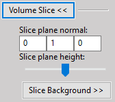
	   
   SliceControlCollapsible, sizer-struktur.

.. figure:: figures/GUI/slice_collapsible_sizers.PNG
   :alt: slice_collapsible_sizers
   :width: 100%
   :figwidth: 25%
   :align: center
	   
   SliceControlCollapsible, sizer-struktur.

Funktioner i klassen är callbacks för olika events som endast kör
motsvarante funktion i *VolumeNetworkHandler*-objektet efter
användarinteraktion.

BackgroundCollapsible
~~~~~~~~~~~~~~~~~~~~~

En kollapserbar meny för att styra en bakgrund i ett inviwonätverk.
Används i både *VolumeControlCollapsible* och *SliceControlCollapsible*
för att styra olika bakgrunder.

Klassen interagerar med ett *VolumeNetworkHandler*-objekt för att kalla
på funktioner för att ändra bakgrunder i de olika bilderna.

*BackgroundCollapsible* låter en användare göra följande:

-  Välja bakgrundsstil.

-  Välja de två färgerna för bakgrundern.

-  Byta plats på färgerna.

-  Välja *blend mode* för bakgrunden.

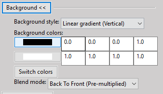

   BackgroundCollapsible-objekt i fönster.

**BgColourWidget:** För att förenkla och abstrahera GUI-strukturen så
har en klass BgColourWidget definerats. Widgeten en *wx.ColourPicker*
där en färg kan väljas. Den har även fyra textfält där en färg manuellt
kan väljas från ett RGBA-värde. Klassen har även funktioner för att
hämta ut och sätta värden i textfälten. Två *BgColourWidget* används i
*BackgroundCollapsible* för att hantera de två färgerna i bakgrunden.

.. figure:: figures/GUI/background_color.PNG
   :name: fig:BgColourWidget
   :align: center
   :width: 50 %
   :figwidth: 50 %
   :alt: BgColourWidget

   BgColourWidget-objekt i fönster.

UnitcellCollapsible
~~~~~~~~~~~~~~~~~~~

En kollapserbar meny för att styra en atompositionsaspekten av en
visualisering. Denna används i både laddningstäthets- och i ELF-menyn
(och bör även användas till partiell laddningstäthet då den läggs till i
gränssnittet).

Klassen interagerar med ett *UnitcellNetworkHandler*-objekt för att
styra den del av inviwonätverket som är relevant. *UnitcellCollapsible*
initierar inte sin egen *UnitcellNetworkHandler* utan variabeln
*networkHandler* måste sättas utifrån klassen innan den kan användas.

 

*UnitcellCollapsible* låter en användare göra följande:

-  Välja radie för enskilda atomtyper.

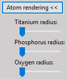

   UnitcellCollapsible-objekt i fönster.

**UnitcellControlWidget:** För att förenkla och abstrahera
GUI-strukturen så har en klass UnitcellControlWidget definerats.
Widgeten består av en *wx.StaticText* för att skriva atomnamnet och en
*wx.Slider* för att välja atomradie. Klassen interagerar med
inviwonätverket via samma *UnitcellNetworkHandler* som den
*UnitcellCollapsible* den är tillagd på.

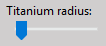

   UnitcellControlWidget-objekt i fönster.

Då gränssnittet, och därmed *UnitcellCollapible*-objektet, först
initieras är inte en HDF5-fil än vald och ingen information om vilka
atomslag som ska ingå i menyn finns. Funktionen *add\_atom\_control*
används därför. Funktionen lägger till ett
*UnitcellControlWidget*-objekt under menyn med ett definerat namn och
index. Efter att en visualisering startas så kallas denna funktion för
att lägga till alla atomer som visualiseringen innehåller.

Parsningsmenyn
--------------

Parser-systemet i ENVISIoN har inkorporerats i det grafiska
gränssnittet. Detta förenklar användning av parsern då tillgång ges till
alla parsning-skript genom kommandon på hög nivå. Filen där det grafiska
gränssnittet har utvecklats heter `ParserPane.py`
När parsnings-menyn fälls ut, från start-fönstret, öppnas ett segment
enligt figur fig:GUIParser_.

.. _fig:GUIParser:	

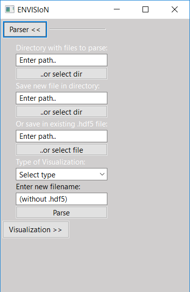

.. image:: figures/GUI/GUIParserLinux.png
   :name: fig:GUIParserLinux.ong
   :width: 29 %
   :alt: GUIParserLinux

*Parsermenyn i ENVISIoN, Linux och Windows.*
	 
Överst i menyn väljs en mapp, innehållande relevanta beräkningsfiler,
som önskas parsas. Detta går att välja genom att skriva sökvägen i
textfältet, wx.TextCtrl, eller genom att trycka på `..or select dir`.
Det senare alternativet öppnar en filhanterare som
tillåter val av mapp. På samma sätt väljs i nästa del en mapp att spara
en ny hdf5-fil där parsningsresultatet lagras. För att spara en ny fil
måste ett filnamn anges under rubriken `Enter new filename:`.
Ett alternativ till detta är om det redan
existerar en hdf5-fil där resultatet önskas sparas. För detta väljs
antingen den filen med filhanteraren, under `..or select file`,
eller genom att skriva sökvägen till filen i rutan
tillhörande knappen. En wx.ComboBox är tillagd som innehåller de
parsningsval som är tillhandahållna av ENVISIoN. Dessa val innefattar:

-  All

-  Bandstructure

-  Charge

-  DoS - Density of States

-  ELF - Electron Localization Function

-  Fermi Energy

-  MD - Molecular Dynamics

-  Parchg - Partial Charge

-  PCF - Pair Correlation Function

-  Unitcell

När användaren är nöjd med sina val trycks parse-knappen längst ned och
ett meddelande dyker upp på skärmen. Detta meddelande innehåller
information om parsningen lyckades eller inte, och för vilken
visualiserings-data parsningen lyckades, om den gjorde det.

 

Det finns huvudsakligen en viktig funktion i parser-skriptet:

-  **parse\_pressed:** Den funktion där parsern aktiveras. Val av typ och
   lagringsval undersöks här. Här sker även felkontroll om parsningen
   lyckats eller inte.

Samtliga fält i parser-menyn som kan ändras har en kopplad funktion för
händelse-hantering.

De filer som GUI:t kommunicerar med i parser-skriptet är:

-  bandstructure.py

-  doscar.py

-  md.py

-  unitcell.py

-  volume.py

-  fermi.py

-  parchg.py

-  PCF.py

-  fermiEnergy.py

-  main.py

Samtliga dessa filer, förutom `main.py`, finns i
mappen `ENVISIoN/envision/envision/parser/vasp`,
`main.py` finns i `ENVISIoN/envision/envision`. Se appendix
sec:GUIAppendix_ för sökvägar relevanta för
GUI:t.

Visualiseringsmenyer
--------------------

Här beskriv de olika visuliseringsmenyernas uppbygnad och funktion.

ChargeFrame
~~~~~~~~~~~

En kollapserbar meny för att starta och styra en
laddningstäthetsvisualisering. Har en *VolumeControlCollapsible*,
*UnitcellCollapsible*, *BackgroundCollapsible*, och
*SliceControlCollapsible* under sig tillsamans med kontroller för att
välja band och aktivera slice och atomrendering.

Klassen tillgängliggör ett gränssnitt för användaren att interagera med
ett *ChargeNetworkHandler*-objekt.

*ChargeFrame* låter en användare göra följande, utöver det som tillåts i
dess underklasser:

-  Starta och avsluta en visualisering (genom att fälla in och ut
   menyn).

-  Välja aktivt atomband som ska visualiseras.

-  Välja om atompositioner ska renderas eller inte.

-  Välja om tvärsnitt ska visualiseras eller inte.

.. figure:: figures/GUI/charge_collapsible_ex.PNG
   :name: fig:ChargeFrame
   :align: center
   :width: 100 %
   :figwidth: 50 %
   :alt: ChargeFrame

   ChargeFrame i fönster.

Speciella funktioner i *ChargeFrame*:

-  **on\_collapse:** Körs då ChargeFrame fälls ut eller ihop.

   -  Om menyn fälls ut så försöker den att starta en visualisering
      genom att initiera ett *ChargeNetworkHandler*-objekt och att
      initiera dess undermenyer med detta.

      Om visualiseringen misslyckas att startas så fälls menyn ihop igen
      och nätverket rensas.

   -  Om menyn fälls ihop så avslutas visualiseringen och nätverket
      rensas.

-  **reset\_canvas\_positions** Sätter visualiseringens canvas-position
   baserat på fönstrets position.

ELFFrame
~~~~~~~~

ELFFrame är identisk jämfört med ChargeFrame med undantaget att en
ELFNetworkHandler används istället för ChargeNetworkHandler samt titeln
på menyn.

ParchgFrame
~~~~~~~~~~~

En kollapserbar meny för att starta och styra visualiseringen av
partiell laddningstäthet. Har en *VolumeControlCollapsible*,
*UnitcellCollapsible*, *BackgroundCollapsible*, och
*SliceControlCollapsible* under sig tillsamans med kontroller för att
välja aktiva band och lägen.

Klassen tillgängliggör ett gränssnitt för användaren att interagera med
ett *ParchgNetworkHandler*-objekt.

*ParchgFrame* låter en användare göra följande, utöver det som tillåts i
dess underklasser:

-  Starta och avsluta en visualisering (genom att fälla in och ut
   menyn).

-  Välja ett godtyckligt antal band som ska visualiseras.

-  Välja om atompositioner ska renderas eller inte.

-  Välja om tvärsnitt ska visualiseras eller inte.

.. figure:: figures/GUI/parchg_collapsible_ex.png
   :name: fig:ParchgFrame
   :align: center
   :width: 100 %
   :figwidth: 50 %
   :alt: ParchgFrame

   ParchgFrame i fönster.

Speciella funktioner i *ParchgFrame*:

-  **on\_collapse:** Körs då ParchgFrame fälls ut eller ihop.

   -  Om menyn fälls ut så försöker den att starta en visualisering
      genom att initiera ett *ParchgNetworkHandler*-objekt och att
      initiera dess undermenyer med detta.

      Om visualiseringen misslyckas att startas så fälls menyn ihop igen
      och nätverket rensas.

   -  Om menyn fälls ihop så avslutas visualiseringen och nätverket
      rensas.

-  **reset\_canvas\_positions** Sätter visualiseringens canvas-position
   baserat på fönstrets position.

-  **reload\_band\_processors** Läser valt band och läge i alla valda
   *BandSelectorWidget* och sätter dessa som aktiva.

2D-visualiseringar i grafer
~~~~~~~~~~~~~~~~~~~~~~~~~~~

Visualiseringar i tvådimensionella grafer i ENVISIoN har många saker
gemensamt. Detta har gjort att gränssnitten för dessa tre
visualiseringar, bandstruktur, parkorrelationsfunktionen och
tillståndstäthet, utvecklades på nästan identiskt vis. Det finns dock
några skillnader.

BandstructureFrame
^^^^^^^^^^^^^^^^^^

är klassen till den kollapsbara menyn för bandstrukturvisualiseringen.
Figur fig:GUIBand_ visar hur denna meny ser ut för
både Windows och Linux. Under denna meny gömmer sig ett antal textfält
och reglage.

.. _fig:GUIBand:

.. image:: figures/GUI/GUIBandWin.png
   :name: fig:GUIBandWin.ong
   :width: 29 %
   :alt: GUIBandWin

.. image:: figures/GUI/GUIDoSLinux.png
   :name: fig:GUIBandLinux.ong
   :width: 29 %
   :alt: GUIBandLinux

*Visualiseringsmenyn för bandstruktur, Linux och Windows.*

PCFFrame
^^^^^^^^

är klassen till den kollapsbara menyn för
parkorrelationsfunktions-visualiseringen. Även figur
fig:GUIPCF_ visar hur denna meny ser ut för både
Windows och Linux. Här syns tydligt hur lika menyerna för
graf-visualiseringarna är vid jämförelse med bandstruktur-menyn.

.. _fig:GUIPCF:	

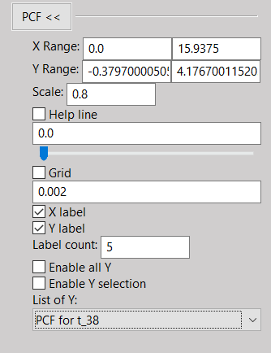

.. image:: figures/GUI/GUIPCFLinux.png
   :name: fig:GUIPCFLinux.ong
   :width: 29 %
   :alt: GUIPCFLinux

*Visualiseringsmenyn för parkorrelationsfunktionen, Windows och Linux.*

DosFrame
^^^^^^^^

är klassen till den kollapsbara menyn för
tillståndstäthetvisualiseringen. Figur fig:GUIDoS_
visar hur denna meny ser ut för Windows och Linux.

.. _fig:GUIDoS:

.. image:: figures/GUI/GUIDoSWin.png
   :name: fig:GUIDoSWin.ong
   :width: 29 %
   :alt: GUIDoSWin

.. image:: figures/GUI/GUIDoSLinux.png
   :name: fig:GUIDoSLinux.ong
   :width: 29 %
   :alt: GUIDoSLinux
 
*Visualiseringsmenyn för tillståndstäthet, Windows och Linux.*

Gemensamt för 2D-visualiseringar i graf
^^^^^^^^^^^^^^^^^^^^^^^^^^^^^^^^^^^^^^^

är uppbyggnad och till största del dess funktion, se figur
fig:GUIBand_, fig:GUIPCF_ och fig:GUIDoS_. Alla dessa meny-klasser är av typen
GeneralCollapsible och ärver därför de funktioner som tillhör denna
generella klass. Utöver detta har varje visualiseringsklass egna
egenskaper. Det som är möjligt att ändra i dessa visualiserngar är:

-  Ändra synligt intervall för båda axlarna genom att sätta minsta och
   största synliga värde i textboxarna, vänster respektive höger, vid
   `X Range` och `Y Range`.

-  Ändra skalningen för hela grafen genom att skriva ett decimaltal
   mindre än ett i rutan för `Scale`

-  Aktivera eller inaktivera en hjälplinje. Denna hjälplinje kan flytta
   antingen med hjälp av manuell inmatning av x-värde i textrutan eller
   genom att dra i skjutreglaget. Vid flytt av skjutreglage uppdateras
   textrutan med det nya x-värdet där linjen placerats.

-  Aktivera eller inaktivera ett rutnät. Detta rutnät är till för att,
   lättare, snabbt kunna läsa av värden på kurvan. Rutnätslinjernas
   tjocklek kan ändras genom att manuellt mata in ett värde mellan
   0.0001 och 0.01 i textfältet under kryssrutan för `Grid`.

-  Hantera etiketter utskrivna längs axlarna i grafen. Dels finns
   möjligheten av visa grafen både utan och med värden längs axlarna.
   Sedan finns även möjligheten att välja hur många sådan etiketter som
   skall finnas längs axlarna. Dessa placeras med jämna intervall från
   minsta synliga värde till största.

-  Välja vilka linjer som skall visas i grafen. Det sista segmentet i
   visualiseringsfönstret för dessa visualiseringar handlar om val av
   data. Det visas för samtliga graf-visualiseringar, en lista med de
   data frames innehållande y-data som finns tillgängliga. Det finns två
   kryssrutor, en för att visa alla linjer och en för att välja en eller
   flera linjer. För att välja flera linjer kan intervall eller enstaka
   linjer väljas genom att skriva dess index i textrutan som öppnas när
   `Enable Y selection` kryssas i.

 

Skillnader mellan 2D-visualiseringar i graf
^^^^^^^^^^^^^^^^^^^^^^^^^^^^^^^^^^^^^^^^^^^

är att tillståndstäthetsvisualiseringen har en möjlighet att välja
vilken partiell tillståndstäthet som önskas visualiseras. Detta genom
att skriva in ett heltal i textrutan för `Partial pick`. För både
tillståndstäthet och parkorrelationsfunktionen kan enstaka linjer väljas
i listan av data frames, för bandstruktur är denna lista enbart en
visuell lista. För visualisering av tillståndstäthet, i fallet att
enhetscell-data finns tillgänglig hdf5-filen, öppnas ett extra fönster
med enhetscellens visualisering.

Samtliga dessa funktioner kommunicerar med visualiseringsnätverket via
funktioner från hjälpfilen paramterer\_utils.py, se kapitel
sec:paramUtils_. Viktiga funktioner som är speciella för
graf-visualiseringar är:

-  **on\_collapse(self, event = None):** Aktiveras vid kollaps eller
   expansion av varje meny. Startar visualisering eller rensar
   nätverket.

-  **start\_vis(self):** Kollar om rätt data finns i given hdf5-fil.
   Kallar på visuaiseringsskriptet eller skickar felmeddelande

-  **init\_DoS(self), init\_bandstructure(self) och init\_PCF(self):**
   Sätter alla parametrar i GUI:t till de som visualiseringen startas
   med.

Utöver dessa finns det funktioner som är kopplade till de element som är
synliga i GUI:t och har en funktion att styra en egenskap hos
visualiseringen.

Inviwointeraktion
-----------------

För att interagera med inviwonätverket och påverka visualiseringarna så
används två olika tilvägagångssätt. För de visualiseringar där
*NetworkHandler*-klasser finns definerade så används dessa. Se kapitel
sec:NetworkHandlers_. För återstående
visualiseringar, PCF, DOS, och Bandstruktur, så används funktioner i en
fil ”parameter\_utils.py” för att interagera med inviwonätverket.

.. _sec:paramUtils:

parameter\_utils.py
~~~~~~~~~~~~~~~~~~~

Filen parameter\_utils.py innehåller funktioner som sköter kommunikaton
med olika processorer i nätverket. Det generella strukturen på dessa
funktioner är att de tar en processoridentitet i form av en sträng. I de
fall att ett värde skall sättas är även detta värde en parameter. De
funktioner som finns i denna fil hanterar till exempel fönsterposition
för det fönster visualiseringarna öppnas i. I denna fil finns även
funktinerna till styrning av parameterar i lineplotprocessorn som är
relevanta för de, i GUI:t, existerande visualiseringarna. Viktiga
funktioner som finns i parameter\_utils är:

-  **clear\_processor\_network():** Rensar arbetsytan från processorer.

-  **change\_scale(scaleValue,processor=’Line plot’):** Ändrar skalningen
   av grafen i lineplotprocessorn

-  **set\_all\_data(processor=”,setAll=True):** Sätter om alla linjer
   skall visas i grafen.

-  **set\_yline\_range(option=1,processor=’Line plot’):** Sätter vilka
   linjer, en eller flera, som skall ritas ut i grafen.

-  **choose\_line(index=1,processor=’Line plot’):** Sätter vilken linje,
   endast en, som skall visas i grafen.

-  **set\_x\_range(value, type, processor=’Line plot’):** Sätter vilket
   intervall som skall vara synligt på x-axeln.

-  **set\_y\_range(value, type, processor=’Line plot’):** Sätter vilket
   intervall som skall vara synligt på y-axeln.

-  **set\_help\_line(value, processor=’Line plot’):** Sätter var
   hjälp-linjen skall vara.

-  **set\_grid(value=None,processor=’Line plot’):** Sätter tjockleken på
   rutnätets linjer.

-  **set\_canvas\_position(position = None, processor=’Canvas’):** Sätter
   visualiseringsfönstrets position.

-  **set\_label(value=None,processor=’Line plot’):** Sätter hur många
   värden som ska skrivas ut på axlarna, borträknat minsta värdet.

-  **set\_partial\_value(option=1,processor=’Line plot’):** För
   tillståndstäthet sätter denna funktion vilken partiell täthet som
   skall visas.

Samtliga funktioner i parameter\_utils.py som sätter ett värde har en
motsvarande funktion som hämtar det värdet som vid tillfället är satt.
Samtliga dessa funktioner är namngivna med stilen `get_[vad som ska hämtas]` till exempel `get_scale`.

Referenser
==========

.. [Inviwo]  *Inviwo* https://inviwo.org/, (hämtad 2019-05-10)

.. [API] https://www.ne.se/uppslagsverk/encyklopedi/lång/api-(data) (hämtad 2019-05-16)

.. [BSD2] *BSD2*, https://opensource.org/licenses/BSD-2-Clause (hämtad 2019-05-10)

.. [Cpp] *C++*, \textit{http://www.cplusplus.com/info/description/} (hämtad 2019-01-28).

.. [dict] *Data Structures*, https://docs.python.org/3/tutorial/datastructures.html (hämtad 2019-05-17).

.. [Fermi-energi] *Solid State Physics*, Neil Ashcroft och David Mermin, 1976, s. 141.

.. [Git]  *Git*, https://git-scm.com (hämtad 2019-01-28).

.. [GUI] *GUI*, https://www.ne.se/uppslagsverk/encyklopedi/lång/api-(data) (hämtad 2019-05-10)

.. [HowToUseHDF5FilesinPython]  *How To Use HDF5 Files in Python*, https://www.pythonforthelab.com/blog/how-to-use-hdf5-files-in-python/, (hämtad 2019-02-26).

.. [Python]  *Python*, https://www.python.org/, (hämtad 2019-01-28)

.. [Python3]  *Python3* https://docs.python.org/3/, (hämtad 2019-05-10)

.. [PyQT]  *PyQT* https://www.riverbankcomputing.com/static/Docs/PyQt5/, (hämtad 2019-05-16)

.. [WhatIsArray]  *Python Arrays*, https://www.programiz.com/python-programming/array\#introduction, (hämtad 2019-05-21).

.. [WhatIsUNIX]  *What is UNIX?*, https://www.softwaretestinghelp.com/unix-introduction/, (hämtad 2019-05-21).

.. [wxPython]  *wxPython*, https://wxpython.org/pages/overview/, (hämtad 2019-05-16)

.. [wxPythonDoc]  *wxPython Documentation*, https://docs.wxpython.org/wx.1moduleindex.html, (hämtad 2019-05-17)

.. [QuickStartGuide]  *Quick Start Guide*, http://docs.h5py.org/en/stable/quick.html\#appendix-creating-a-file, (hämtad 2019-02-26).

.. [RadialDistributionFunction]  *Radial distribution function*, https://en.wikipedia.org/wiki/Radial\_distribution\_function, (hämtad 2019-03-03).

.. [HDFGroup]  *The HDF Group, Hierarchical Data Format, version 5 1997-2019*, https://support.hdfgroup.org/HDF5/, (hämtad 2018-01-28).

.. [HDFGroup2]  *The HDF Group. High Level Introduction to HDF5. 23 Sept. 2016*, https://support.hdfgroup.org/HDF5/Tutor/HDF5Intro.pdf, (hämtad 2019-01-28).

.. [Unittest]  *Unittest*, https://docs.python.org/3/library/unittest.html, (hämtad 2019-03-06).

.. [VASP]  *VASP*, https://www.vasp.at/index.php/about-vasp/59-about-vasp, (hämtad 2019-02-26).

.. _sec:appendixHDF5:

Appendix A - ENVISIoNs HDF5-filstruktur
=======================================

.. image:: figures/UPDATE-hdf5-dataformat3modi.png
   :width: 100%

.. _sec:GUIAppendix:

Appendix B - Sökvägar till filer relevanta för GUI:t
====================================================

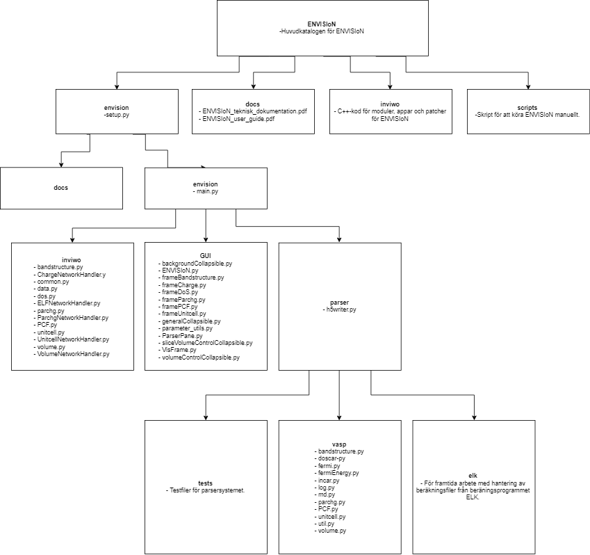

